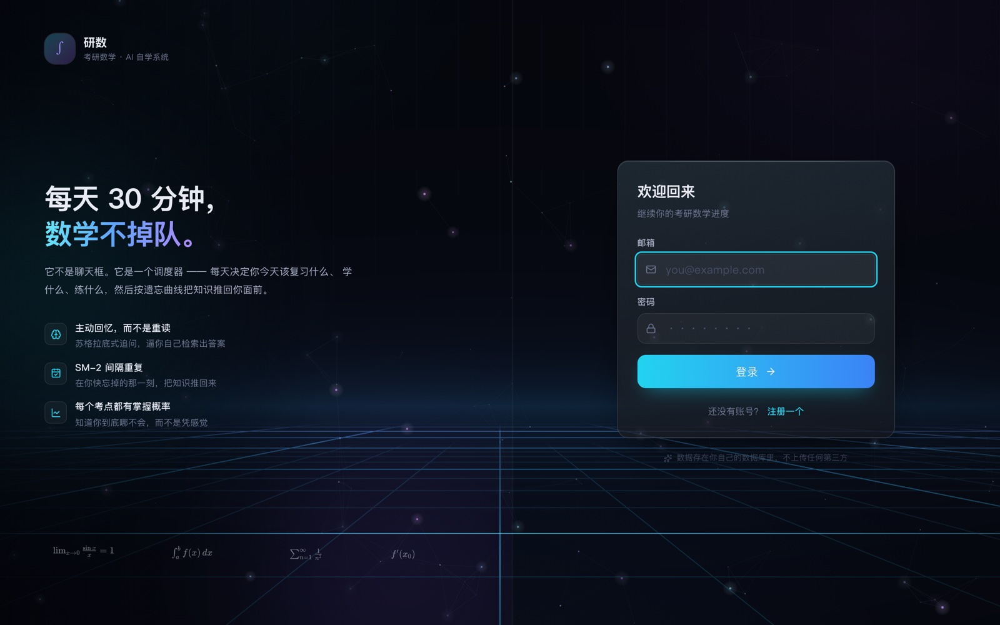
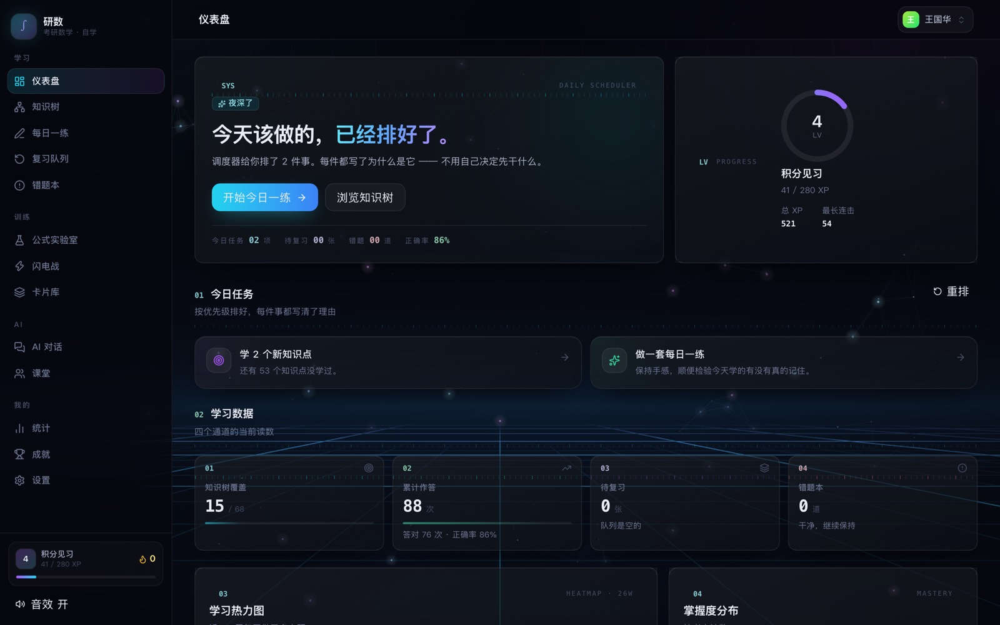
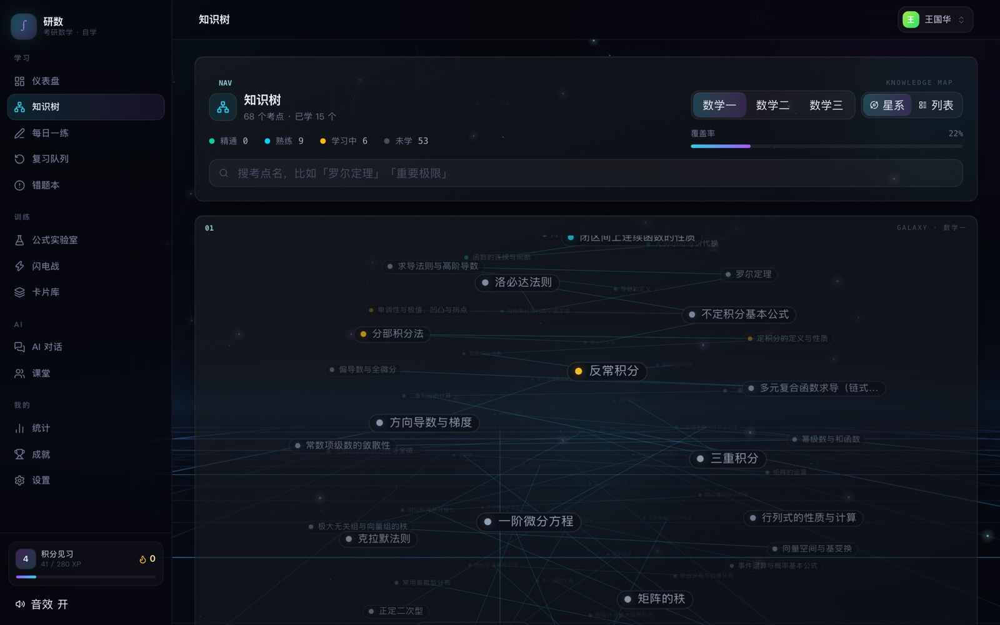
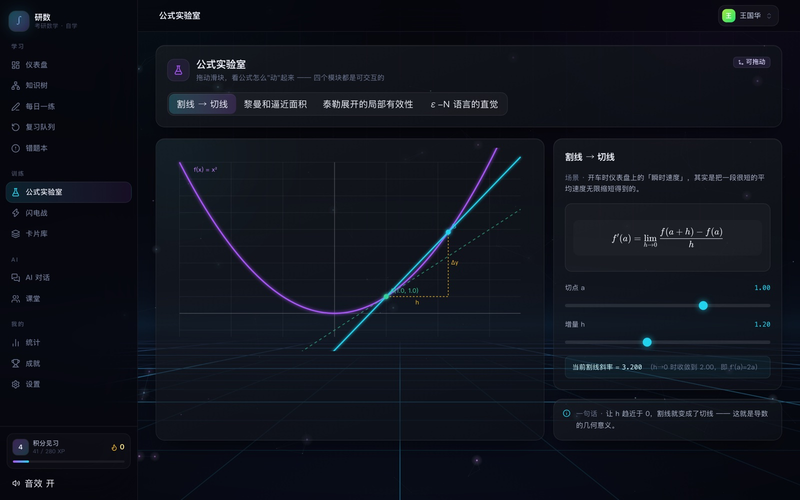
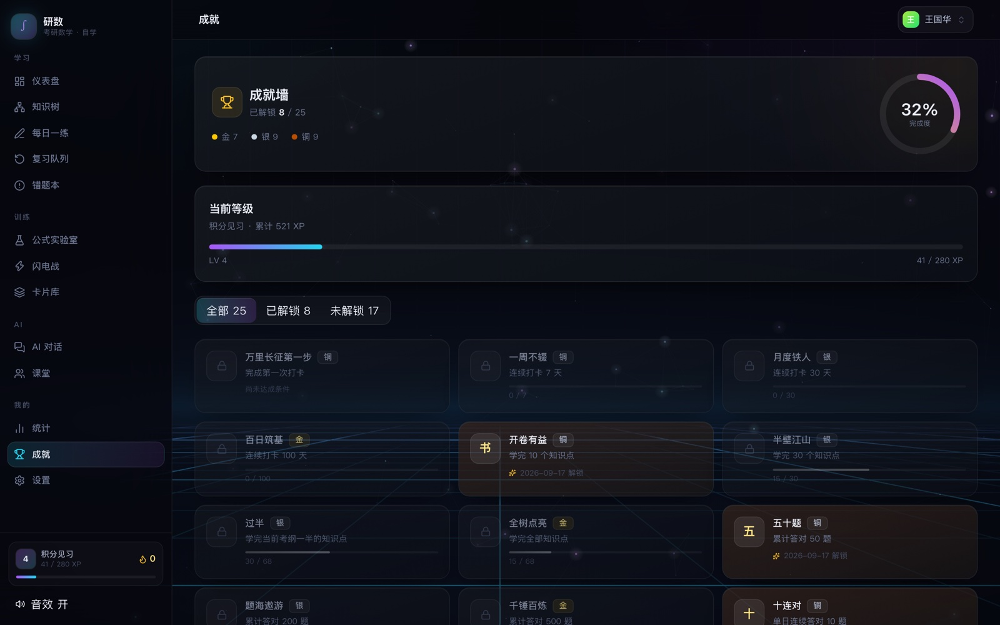

# 研数 · 考研数学 AI 自学系统

从零依赖纯前端（localStorage）重构成的前后端分离全栈版本。原来的 13 个页面、68 个知识点、204 道题**一个都没丢**，算法层（SM-2、XP、掌握度、成就）原样移植，UI 层用 React 重写，数据从浏览器搬进了 SQLite，并补上了账号体系。

暗色深空 + 玻璃拟态 + **赛博网格地平线**。下面全是实拍截图，不是效果图：

### 登录 / 注册

<picture>
  
</picture>

### 仪表盘 —— 今天该做的已经排好了

<picture>
  
</picture>

### 知识星系 —— 68 个考点铺成一个可以拖着转的 3D 球

<picture>
  
</picture>

### 知识点详情 —— 公式用 KaTeX 渲染，可复制

<picture>
  
</picture>

### 公式实验室 —— 拖滑块看公式怎么「动」起来

<picture>
  
</picture>

### 成就墙 —— 25 项成就，铜 / 银 / 金

<picture>
  
</picture>

> 截图由 `npm run shots` 生成：起真浏览器、注册账号、**先灌一份有分布的学习数据再逐页拍**。
> 空状态下所有页面都是「还没有卡片」，看不出配色和密度对不对 —— 而设计问题恰恰只在有内容时才暴露。

---

## 快速开始

```bash
npm install
npm run start          # 后端会托管 web/dist，打开 http://127.0.0.1:5180
```

第一次跑之前要先构建前端（`npm run start` 找不到 `web/dist` 时只提供 API）：

```bash
npm run check          # 类型检查 + 构建
npm run start
```

macOS 上可以直接双击 `启动.command`，它会自动装依赖、构建、起服务、开浏览器。

**开发模式**（前后端热更新，前端 5173、后端 5180，`/api` 自动代理）：

```bash
npm run dev
```

---

## 目录结构

```
kaoyan-math-tutor/
├── server/                     Fastify 5 + better-sqlite3
│   ├── src/
│   │   ├── index.js            入口：鉴权闸门 / 静态托管 / SPA fallback
│   │   ├── db/
│   │   │   ├── schema.sql      25 张表
│   │   │   ├── index.js        连接、建表、rebuildStats()
│   │   │   └── seed.js         幂等种子导入
│   │   ├── lib/
│   │   │   ├── sm2.js          间隔重复算法
│   │   │   ├── game.js         XP / 等级 / 掌握度 / 25 项成就 / 连续打卡
│   │   │   ├── judge.js        判题器（归一化 + 数值容差）
│   │   │   ├── password.js     scrypt 哈希
│   │   │   └── session.js      会话（库里只存 token 的 sha256）
│   │   ├── routes/             auth / catalog / study / cards / game / misc / ai
│   │   └── data/               从原项目提取的 3 科 19 章 68 考点 204 题
│   └── scripts/
│       ├── extract-seed.mjs    用 node:vm 沙箱从原 window.KDATA/QDATA 提取
│       └── smoke.mjs           接口端到端测试（134 项）
├── web/                        Vite 8 + React 19 + TS + Tailwind 4
│   └── src/
│       ├── styles/index.css    设计系统（深空底 / 玻璃面 / 光谱强调色 / HUD）
│       ├── components/
│       │   ├── fx/             视觉特效层，全部自研、零依赖：
│       │   │   ├── webgl.ts            全屏片元着色器封装（约 120 行）
│       │   │   ├── CyberGrid.tsx       WebGL2 赛博网格地平线背景
│       │   │   ├── Starfield.tsx       Canvas2D 星尘
│       │   │   ├── KnowledgeGalaxy.tsx 可旋转 3D 知识星系
│       │   │   ├── Hud.tsx             仪器感装饰（角标/刻度/读数/扫描线）
│       │   │   └── Motion.tsx          数字滚动 / 倾斜卡 / 进度环 / 进度条
│       │   ├── ui/             Primitives、Math（渲染管线）、Modal、Toaster
│       │   └── layout/         AppShell、AuthLayout
│       ├── lib/                api / utils / hooks / sfx / achievements / deckExport
│       └── pages/              15 个页面
└── tests/
    ├── browser-smoke.mjs       真浏览器冒烟（115 项，CDP，零依赖）
    ├── screenshot.mjs          逐页截图（npm run shots），供人眼审查
    ├── latex-coverage.mjs      公式渲染全量检查
    ├── pipeline-leak.mjs       渲染管线漏屏检查（真 katex 跑完整 renderRich）
    ├── lib/server.mjs          测试用的服务生命周期（空闲端口 + 一次性库）
    └── run-all.mjs             汇总入口
```

---

## 技术选型与理由

| 选择 | 理由 |
|---|---|
| **SQLite（better-sqlite3）** | 单人自用的学习工具，上 PostgreSQL 是给自己找运维。better-sqlite3 是同步 API，事务写起来干净，不用到处 `await`。 |
| **Fastify** | schema 校验内建，把「参数不对」挡在业务代码之前。 |
| **不用 JWT，用服务端会话** | JWT 没法即时登出。「注销账号 / 登出所有设备」是刚需，所以会话表 + httpOnly cookie。 |
| **scrypt 而非 bcrypt** | Node 内置，不引原生编译依赖。N=16384 / r=8 / p=1，每用户独立盐，比对走 `timingSafeEqual`。 |
| **React + Tailwind 4** | 原版是 4492 行的字符串拼接渲染，改一处要全文搜。 |
| **Vite 8（Rolldown）** | 注意：Rolldown 下 `manualChunks` 只接受函数形式，对象形式会直接构建失败。 |
| **不引粒子库** | 星尘粒子自研不到 100 行；tsparticles 是 60–200KB。 |

---

## 数据模型

**核心不变式：明细表是权威，聚合表只是加速层。**

原版因为 localStorage 只有 5MB，必须在裁剪明细之前把统计冻结下来 —— 一旦裁剪，统计就再也没法重算。搬到数据库后这个约束消失了：

- `attempts` **全量保留**，永不裁剪
- `stats_node` / `stats_question` / `stats_daily` 纯属加速，任何时候都能用 `rebuildStats(userId)` 从明细完整重建
- 代价是每次作答要写 4 张表 —— 所以整个作答流程包在**一个事务**里，避免「题算对了但 XP 没加上」这种偏账

25 张表：

```
账号      users / sessions / auth_log / user_settings / llm_settings
内容      categories / chapters / knowledge / questions
学习      attempts / stats_node / stats_question / stats_daily
复习      cards / card_deck / notes
计划      checkins / daily_plan / focus_sessions
游戏化    game_state / achievements / boss_records
AI        chats / classrooms
```

---

## 算法层（从原版逐函数移植）

### 判题 `judge.js`

全角转半角、剥 LaTeX 反斜杠、`π→pi`、`√→sqrt`、`²→^2`、分数求值比对（`1/2` 等价 `0.5`）、数值容差 `1e-6`。

选择题也要过同一套归一化 —— 中文输入法下用户很容易打出全角的 `Ａ Ｂ Ｃ Ｄ`，只 `trim + toUpperCase` 会直接判错，那不是学生答错，是输入法的问题。

### 间隔重复 `sm2.js`

四档自评（1 忘了 / 2 吃力 / 3 记得 / 4 很熟）映射到 quality（1/3/4/5），EF 下限 1.3，首轮间隔 1 天。**新建的卡排在明天**，这是 SM-2 的标准行为，不是 bug。

### 掌握度

`new`（未学）→ `learning`（学习中）→ `proficient`（熟练）→ `mastered`（精通）。

精通的门槛是三条**同时**成立：该节点下每道题都答对过 + 作答 ≥ 3 次 + 正确率 ≥ 90%。

### XP 防刷分

```
answerXp = max(1, round(10 × 掌握度倍率 × 当日重复倍率))
掌握度倍率  { new: 1, learning: 1, proficient: 0.5, mastered: 0.2 }
当日重复倍率 第 1 次 1.0 / 第 2–3 次 0.7 / 第 4 次起 0.3
```

下限 1 是故意的：答错也给参与分，但不给连击。

### 等级

升到第 n 级需要 `100 + (n-1)×60` XP，12 个称号：初识极限 → 数轴新兵 → 求导学徒 → 积分见习 → 级数行者 → 多元探索者 → 曲线猎手 → 矩阵行者 → 概率赌徒 → 极限猎人 → 定理克星 → 考场主宰。

### 连续打卡

打卡条件 = 当日任务全部完成 **或** 专注时长 ≥ 30 分钟。当前连续从今天（若今天没打则从昨天）往回数。

### 成就

25 项，铜 / 银 / 金三档，纯谓词判定。发奖用幂等键 `flags[xp:key]` 去重，重复触发不会重复发。

---

## 富文本渲染管线（最容易被改坏的地方）

输入有两个来源，格式**不一样**：

- **模型输出**：数学写在 `$...$` / `$$...$$` 里
- **库里的数据**：**裸 LaTeX，一个 `$` 都没有** —— 68 个知识点的正文与例题、204 道题的题干与解析，全是「中文句子里夹着 `\frac{...}`」

两者进同一个渲染器，所以顺序至关重要：

```
1. 行内代码 `...`        → 摘成占位符
2. Markdown 链接          → 摘成占位符（URL 里带 _ 和 &，晚了会被当公式）
3. 已带定界符的数学 $…$   → KaTeX
4. __加粗__               → 摘成占位符（晚了会被 autoLatex 当两个裸下标）
5. autoLatex              → 给裸 LaTeX 补 $
6. 刚补出来的 $…$         → KaTeX
7. 剩余纯文本             → HTML 转义 → Markdown 强调
8. 占位符回填
```

顺序反了会出两种 bug，都真实踩过：

- **先按 `$` 切分再套 `**`**：「`**当 $x\to 0$ 时**`」被从中间切开，两半各剩一个 `**`，屏幕上就是裸露的星号
- **autoLatex 在 `$` 之前跑**：把已有的 `$\frac{1}{2}$` 再包一层 `$`，原来的定界符反而变成普通字符打到屏幕上

占位符用 `\u0001N\u0002`，并且被 `FRAG_STOP` 当作硬边界 —— 这样 autoLatex 的片段回溯不会跨过已渲染的公式去吞文本。

**验证方式**：`tests/browser-smoke.mjs` 会抽 4 个知识点 + 每日一练，把所有已交给 KaTeX 的节点从 DOM 里删掉后，检查剩余文本里不再有 `\命令` 和 `**` / `$$` / 占位符。

---

## 安全

| 项 | 做法 |
|---|---|
| 密码 | scrypt（N=16384, r=8, p=1）+ 每用户 16 字节随机盐 + `timingSafeEqual` |
| 会话 token | 32 字节随机值，**库里只存 `sha256(token)`**，原文仅存在于 httpOnly cookie |
| Cookie | `httpOnly` + `sameSite=Lax`（生产环境自动加 `secure`），30 天 TTL |
| 账号探测 | 登录时即使用户不存在也走一次哈希计算，响应时间不泄露账号是否存在 |
| API Key | **服务端存库，永不回传原文**。`GET /api/settings/llm` 只返回 `hasKey` 布尔 + `keyPreview`（前 6 后 4 位）。`/api/export` 默认剥掉 Key |
| 限流 | 注册 / 登录 10–12 次每 10 分钟 |
| 鉴权闸门 | 全局 `onRequest` 钩子，白名单之外所有 `/api/*` 都必须带有效会话 —— 挂在每个路由上迟早漏一个 |

> 原版把 API Key 存在 localStorage，任何 XSS 都能拿走。这是搬服务端最主要的动机之一。

---

## 测试

```bash
npm test               # 跑全部：13 + 23 + 168 + 115 = 319 项
npm run test:api       # 只跑接口
npm run test:browser   # 只跑浏览器
npm run test:latex     # 只跑公式渲染全量检查
npm run test:pipeline  # 只跑渲染管线漏屏检查
npm run shots          # 逐页截图，供人眼审查（不是断言）
```

**不需要先起服务。** `npm test` 会自己挑一个空闲端口、用一次性数据库起一个服务，跑完杀掉并删库 —— 它不会碰 `server/data/app.db`，也不会因为你本机开着 dev 服务而冲突。

想对着已经在跑的服务测：

```bash
BASE=http://127.0.0.1:5180 npm test
```

> 这个设计是踩坑换来的。两个套件以前都假设「5180 上已经有人把服务起好了」，于是测试结果不取决于代码，而取决于**当时那个服务是谁起的、连的哪个库、有没有被改过**。实际代价：本机残留的旧服务占着端口，新服务绑不上，满屏「等待超时」，报出 44 项失败 —— 而代码一行没错。反过来更阴：残留服务恰好是好的，测试全绿，但你验证的其实是几分钟前编译的旧产物。

- **接口套件**（`server/scripts/smoke.mjs`）：注册 → 会话 → 知识树 → 真实判题作答 → 学情 → 错题 → SM-2 复习 → 统计 → 成就 → 每日任务 → 课堂持久化 → 导出 → 登出重登 → **多账号数据隔离**。
- **浏览器套件**（`tests/browser-smoke.mjs`）：用系统里已有的 Chromium 内核 + Node 22 自带的 `WebSocket` 说 CDP，**零 npm 依赖**。真开页面走完 14 个路由，断言 canvas 真的画了东西（数非透明像素）、切模块后画布真的重画、拖滑块读数真的变、公式真的渲染且没漏源码。找不到浏览器会优雅跳过。
- **渲染套件**（`latex-coverage.mjs` + `pipeline-leak.mjs`）：用真 katex 跑完整 `renderRich`，全量扫 204 题 + 68 知识点共 1304 段文本，检查两条不变量 —— KaTeX 解析失败 = 0、裸命令漏屏 = 0。管线代码是**从 `Math.tsx` 现场抽**的（调 tsc），不手抄副本。

> 浏览器套件里有个关键细节：启动参数必须带 `--use-gl=angle --use-angle=swiftshader --enable-unsafe-swiftshader`。**不加这三个参数，headless 下 `getContext('webgl2')` 直接返回 null**，赛博网格背景会静默降级成 CSS 备胎 —— 于是「背景画出来了」这条断言测的其实是备胎，主胎装没装上根本不知道。SwiftShader 是纯 CPU 实现，慢，但确定性好（CI 上也一样）。

> 还有一条反过来的坑：**headless Chrome 默认上报 `prefers-reduced-motion: reduce`**。所以「等 350ms 看动画有没有动」这种断言在 CI 上必红，而它红的原因跟代码好坏毫无关系 —— 组件是**遵守**这个偏好的。要验「主循环还活着」，得用 CDP 的 `Input.dispatchMouseEvent` 真拖一下：拖动是用户主动操作，任何偏好下都必须生效。
>
> 顺带一提，不要用 JS 造 `PointerEvent` 来模拟拖拽 —— 组件里调了 `setPointerCapture`，合成事件的 `pointerId` 是假的，会直接抛异常，然后你会以为是自己代码写错了。

> 这一层还有一个隐蔽的坑：`skip()` 出来的「因环境跳过」既不算通过也不算失败，如果汇总行只报 pass，那么「本机跑不了 WebGL、4 条断言被跳过」和「4 条断言真跑绿了」在父进程看来**一模一样**。所以跳过数必须写进汇总行，`run-all.mjs` 那边也要显式出声。

> 这两个套件是有价值的：`vite build` 通过 + `tsc` 零错误 + 接口全绿的那一版，**整个应用是白屏的** —— `App.tsx` 里 `BootScreen` 调了 `useLocation()` 却渲染在 `<BrowserRouter>` 外面。只有真开一次浏览器才发现。
>
> 还有一条纪律：**别把「跳过」当「通过」。** 浏览器套件找不到 Chromium 时会打印说明并以 0 项退出，而 0 项和全绿在汇总里长得一样。所以 CI 里专门有一步先确认 runner 上真的有浏览器。

---

## 视觉

暗色深空 + 玻璃拟态 + 赛博网格地平线，三层色彩体系：

```
--ink-*       深空底    背景，永远比内容暗，带一点冷色偏移
--glass-*     玻璃面    卡片与面板，半透明 + 模糊 + 一像素内发光边
--spectrum-*  光谱强调  青 → 蓝 → 紫，只用于「需要被看见的东西」
```

纪律写在 CSS 注释里：不用高饱和纯色大面积填充；强调色只出现在文字、描边、光晕和小面积填充上；**长时间盯着看的东西（正文、列表）一律用低饱和的 ink 系列**。

### 背景是三层，顺序不能换

```
-z-20  CyberGrid    WebGL2 赛博网格地平线 —— 唯一有「地面」的层，负责纵深
-z-10  Starfield    Canvas2D 星尘 —— 浮在最前，天空里要有星星
-2/-1  body::before / ::after   CSS 径向光晕 + 静态网格（降级备胎）
```

`CyberGrid` 是一个**零依赖的全屏片元着色器**（约 210 行封装 + 110 行 GLSL）：地面透视网格（主格 + 细格）、沿 z 轴推进的能量脉冲、同心涟漪、地平线暮色光带、扫描线、暗角。没有引 three.js —— 这里要的只是「一个全屏三角形 + 一个片元着色器」，three.js 是 +600KB 换一整套用不上的场景图 / 相机 / 材质系统。WebGL2 的 `gl_VertexID` 让全屏三角形连顶点缓冲都不用建。

三个工程上的决定：

- **DPR 上限 1.25**。全屏着色器是逐像素成本，2x 屏上等于 4 倍像素量，而背景是柔和渐变，1.25 与 2.0 肉眼无差 —— 像素量只有 2x 的 39%。连续掉帧（`dt > 26ms` 累计 24 帧）还会再降到 0.85。
- **编译失败不抛异常，只 `console.warn` 后返回 `null`**。背景是装饰不是功能，着色器挂掉不该让整页崩掉，上层看到 `null` 就退回 CSS 备胎。
- **拿得到 WebGL2 时，在 `<html>` 上挂 `fx-webgl` 类**，CSS 据此把静态网格从 `opacity .32` 压到 `.07` —— 一层平铺的正交网格叠在透视网格上，两套网格会互相打架。

`prefers-reduced-motion` 下只渲染一帧静态图；页面隐藏时停 rAF；`webglcontextlost` 必须 `preventDefault()` 否则浏览器不会尝试恢复。

### HUD 装饰层（`fx/Hud.tsx`）

深色 + 玻璃 + 圆角 + 渐变强调色，这套组合已经被所有 AI 产品用烂了 —— 换个 logo 就能套在任何一个 SaaS 上。问题不在配色，在**结构语言**：那些界面看起来像「网页」，不像「仪器」。数学工具本该像精密仪表盘。

所以加了一层纯装饰的 HUD：四角角标（只画两个边的 L 形，是「取景框」不是「边框」）、刻度尺（`repeating-linear-gradient` 画，150 个刻度不生成 150 个 DOM 节点）、等宽编号与读数（`01`–`06` 让一排卡片从「四个方块」变成「四个通道」）、指针跟随的描边高光（`mask` 挖掉中间只留 1px，是发光边不是发光块）、悬停时掠过的扫描线。

### 知识星系（`fx/KnowledgeGalaxy.tsx`）

知识点排成一个可拖拽旋转的 3D 球。**不用纯 CSS 3D transform** —— 节点转到球体侧面会被压成一条线，转到背面还会互相穿透。改成经典的「3D 标签云」：Fibonacci 球面布点（黄金角，不结块）、按纬度排序后切给各科目（于是每科自然形成一条纬带，颜色成片而不是随机撒点）、每帧在 JS 里做旋转 + 透视除法投影成 `translate3d + scale`。节点天然是 billboard，按深度调透明度和大小。

同章节的节点连线画在一张 canvas 上 —— 用 SVG 的话 68 条线就是 68 个 DOM 节点每帧改属性。

节点是真的 `<Link>`，能 Tab 到、能被读屏读到；搜索和逐条浏览仍由列表视图承担（顶部可切换）。星系是「看」的入口，列表是「用」的入口，两者都不能少。

**背半球必须额外压一档。** 透视除法原本是 `1 / (1 + z2 * 0.42)`，于是背面的标签半径只比正面小 30% —— 68 个标签里有一半挤在球心那一片，糊成一团。现在 `z2 > 0` 时再叠一个 `+ z2 * 0.32`：只压背面、不放大正面（放大正面只会让近处标签互相盖住）。配套把不透明度从线性改成 2.2 次幂 + 0.07 地板：

```
深度 0.25 → 0.61     深度 0.50 → 0.32     深度 0.75 → 0.14     深度 1.0 → 0.07
```

前面几个字清清楚楚，后面半颗球只剩一层星尘。地板留 0.07 而不是 0，是因为全透明的节点仍然占着 Tab 焦点 —— 键盘用户会 Tab 到「看不见的东西」上。

星系原本是这个项目里**唯一没有断言守着的旗舰组件**：主循环死掉、节点全挤在球心、切视图不生效，三种坏法都不会让页面报错，截图里也「看着有东西」。现在 `browser-smoke` 的第 3b 节有 12 条断言管着它，包括用 CDP 真鼠标事件拖一下、比对拖动前后的 `transform`。

### 自研特效（不引库）

Canvas 星尘粒子（视差分层 + 近邻连线 + 每星独立闪烁相位 + 页面隐藏时暂停）、3D 倾斜卡片（最大 6° 的克制倾角）、鼠标跟随光晕、数字滚动、进度环、`@property --angle` 旋转渐变边、扫光按钮、WebAudio 程序化音效（零音频文件，答对音高随连击升调）。

打印用 `#print-portal` 与屏幕样式隔离；`prefers-reduced-motion` 下动画全部关闭。

---

### 四条踩过的坑

这四条有个共同点：**测试全绿、页面不报错、肉眼看着「没问题」，但那个最贵的东西其实死了 —— 或者探针指着别处。**

#### 一、透明度要跟着线宽走

图表网格最初写的是 `rgba(255,255,255,0.055)`，在普通深色底上完全合理 —— 但本站底色是 `#03040a`（近黑），叠出来约等于 rgb(17,18,23)，**对比度 1.05:1，等于没画**。雷达图尤其惨：整个三角形骨架消失，只剩一根数据线悬在空中。

判据是这条：

| 元素 | 线宽 | 可用 alpha |
|---|---|---|
| 网格线 / 分隔线 | 1px | **0.15–0.22** |
| 环形轨道 / 进度底 | 5px+ | 0.06–0.08 |

细线的可视性靠「每像素亮度差」，粗线靠「整块面积」——**线越细，alpha 越要往上加**。而直觉正好相反：细线看着「轻」，于是越调越淡。底色越黑，同一个 alpha 得到的绝对亮度差越小，所以「这个透明度够不够」不能单独判断，必须连底色明度和笔触宽度一起看。

#### 二、body 的 background 会盖住所有负 z-index 层

CSS 绘制顺序（CSS 2.1 附录 E）：

```
根元素背景 → 负 z-index 子元素 → 普通流块级元素的背景 → ……
```

注意第二项和第三项的顺序。`body` 是普通流块级元素，**它的背景画在负 z-index 之后**。所以只要 `body`（或中间任何一层）画了不透明的 `background`，`-z-20` 的赛博网格和 `-z-10` 的星尘就**整层被盖住**。

症状极具欺骗性：着色器在跑、画布尺寸正确（1800×1125）、`gl.getError()` 是 0、控制台干净、页面「有背景」—— 那是 CSS 备胎。排查了四十分钟，最后把 canvas 临时提到 `z-index: 99999` 才一眼看穿。

修法：底色挂在 `html` 上（作为画布底色，永远在最底层）。注意 `web/index.html` 里那段**首屏防闪白的内联样式**也设了 `html, body { background }`，它在 bundle 之前生效，是最容易被漏掉的一处。

现在 browser-smoke 里有三条断言守着：canvas 到 html 之间没有不透明背景、`body` 自己没背景、`html` 有底色。另加一条端到端断言 —— 把背景 canvas 藏掉再截一次图，比较全图平均亮度，差值必须大于 0.5（实测 5.1）。用全图均值而不是单点采样，是因为星尘在闪烁，单点会撞上星星造成假阳性。

#### 三、着色器编译失败是静默的

把 `` const float HORIZON = -0.12; `` 写成 `` const HORIZON = -0.12; ``（丢了类型），编译报 `ERROR: 0:14: '=' : syntax error`。因为「失败返回 null 不抛异常」这条纪律，组件**静默降级成 CSS 背景** —— 15 张截图张张看着没问题。

所以 `npm run shots` 每张图都会报一次背景走的是哪条路（`WebGL` / `CSS降级`），browser-smoke 也会断言 `fx-webgl` 已挂上。**降级态长得对，不代表主路是通的。**

#### 四、`querySelector('canvas')` 抓到的未必是你要的那个

截图脚本原本用 `document.querySelector('canvas[aria-hidden="true"]')` 报背景画布尺寸。加了知识星系之后，知识树那一张开始报 **1224×765**，而其余 14 张都是 1800×1125 —— 看起来像「背景尺寸算错了」，实际是它抓到的是**星系自己的连线画布**（DOM 里排在前面，也带 `aria-hidden`）。

修法：给关键 canvas 都挂 `data-fx`，探针点名要哪个。同理，星系节点挂了 `data-galaxy="node"`、容器挂了 `data-galaxy="host"` —— 页面上 canvas 和 `<a>` 都不止一个，**靠位置或宽泛属性选元素，迟早选错**。

> 判据是「这个数字跟其他页对不上」。如果当初没顺手把尺寸打出来，这个探针会一直悄悄指着错误的对象，而所有断言照样全绿。

---

这类问题**测试查不出来**（元素在、尺寸对、断言全绿），只有截图用眼睛看才发现 —— 所以有了 `npm run shots`。

---

## 部署

单进程，后端托管前端构建产物：

```bash
npm run check && npm run start
```

环境变量：`PORT`（默认 5180）、`HOST`（默认 127.0.0.1）、`LOG_LEVEL`。

数据落在 `server/data/app.db`，**已在 `.gitignore` 里** —— 那里有账号和全部作答记录，绝不能入库。备份就是复制这个文件（连同 `-wal` / `-shm`，或先 `sqlite3 app.db "PRAGMA wal_checkpoint(TRUNCATE);"`）。

想换台机器：`npm install && npm run check`，然后把 `app.db` 拷过去，或者用页面上的导出 / 导入。

### 为什么不用 GitHub Pages

这个仓库以前开着 Pages，部署的是旧版纯前端静态站。全栈版**主动把它关掉了**，两个原因：

1. 全栈版的核心价值 —— 账号、跨设备同步、服务端持久化、API Key 不落浏览器 ——
   **恰恰是静态托管给不了的**。没有 Node 进程，这些一个都不成立。
2. 而如果只把 `web/dist` 发到 Pages，你会得到一个**能打开、但什么都存不住**的壳：
   注册登录接口全部 404，比没有线上版本更糟 —— 它看起来是好的。

想线上跑，就找个能跑 Node 的地方（任意 VPS / Railway / Fly.io / 家里一台常开的机器），
`npm run check && npm run start` 即可。数据是单文件 SQLite，备份就是复制 `app.db`。

> 顺带一提：Pages 的 `build_type` 是 `legacy`（Jekyll 从 master 根目录构建）。
> 所以关它必须**先于**合并全栈版 —— 否则合并会触发一次 Jekyll 构建，
> 在一个 Vite 项目上必然产出垃圾或直接失败。

---

## 已知边界

- **AI 功能需要自己配模型**。设置 → 模型接入，填 Base URL 与模型名（OpenAI 兼容接口即可）。Key 存在服务端，不进浏览器。不配也能用，只是对话 / 课堂 / 知识点提取会给出明确提示而不是静默失败。
- **专业课考点库是空的**，需要自行填充。
- 多智能体课堂的「三个学生各错各的」靠提示词约束，模型不听话时页面会提示「模型这次没按格式回」，可以直接重试。
- 本机无 PostgreSQL 也无 Docker，所以选了 SQLite；真要多人在线再换。

---

## 许可

沿用原项目的 LICENSE。
