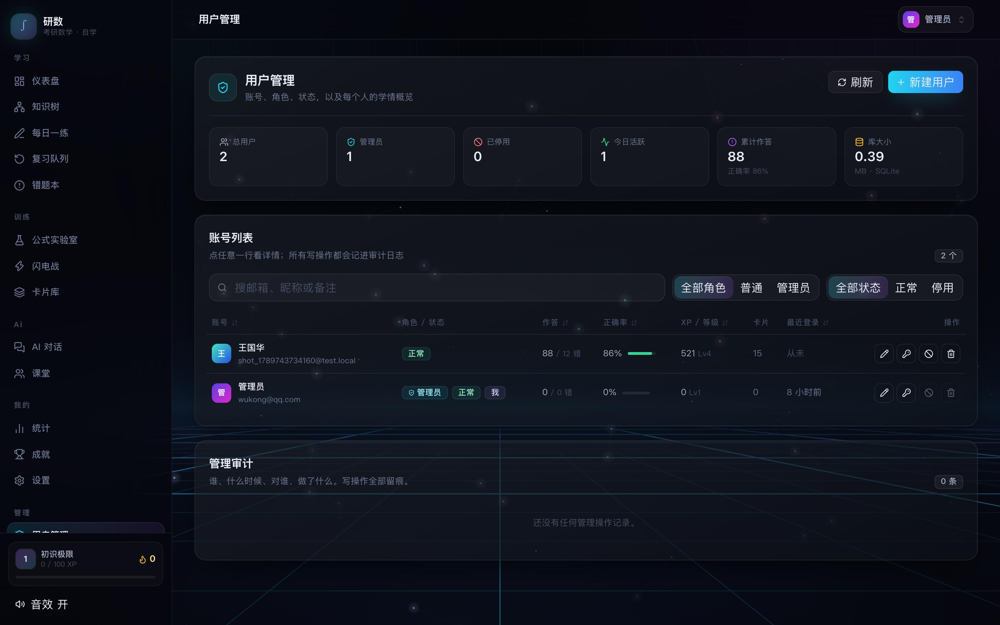
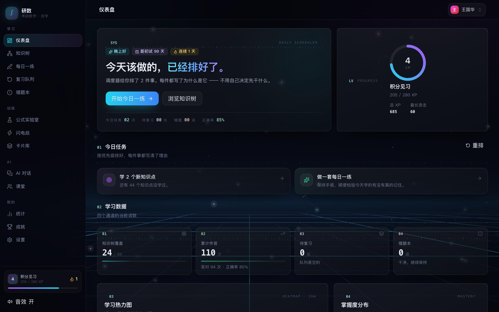
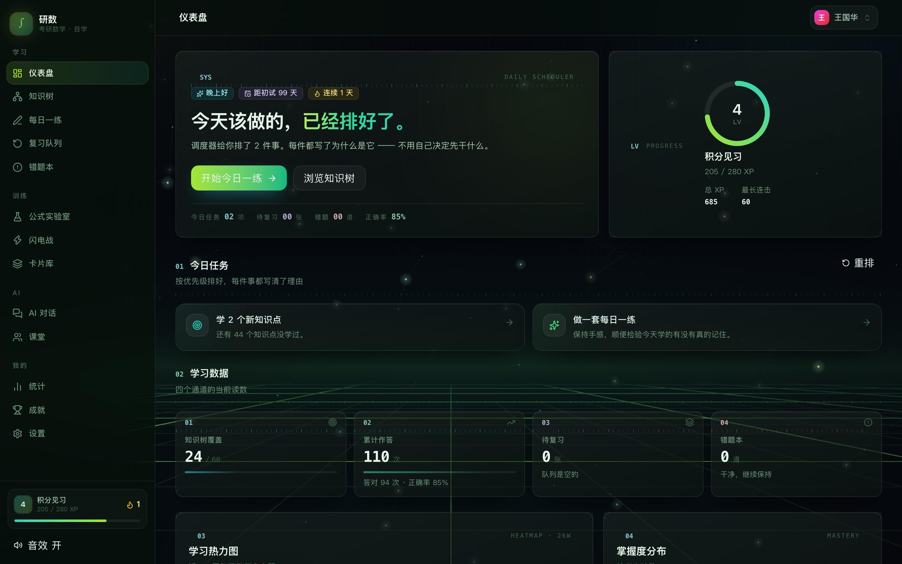
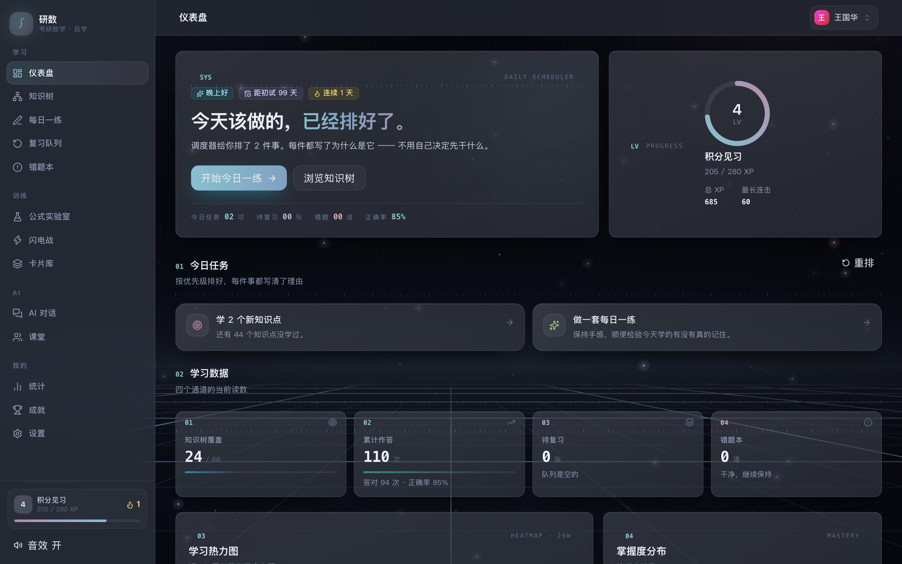
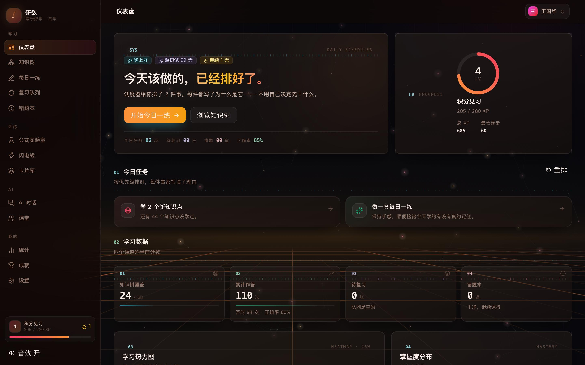
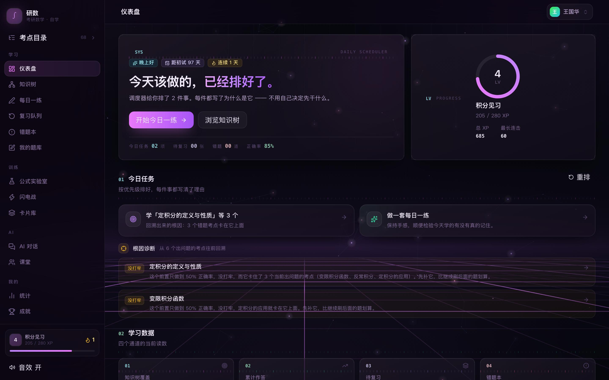
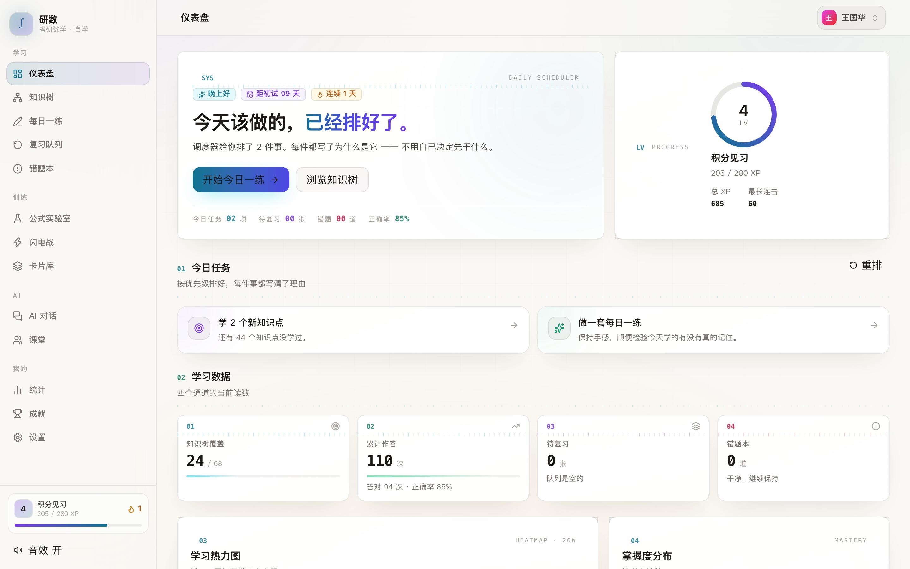
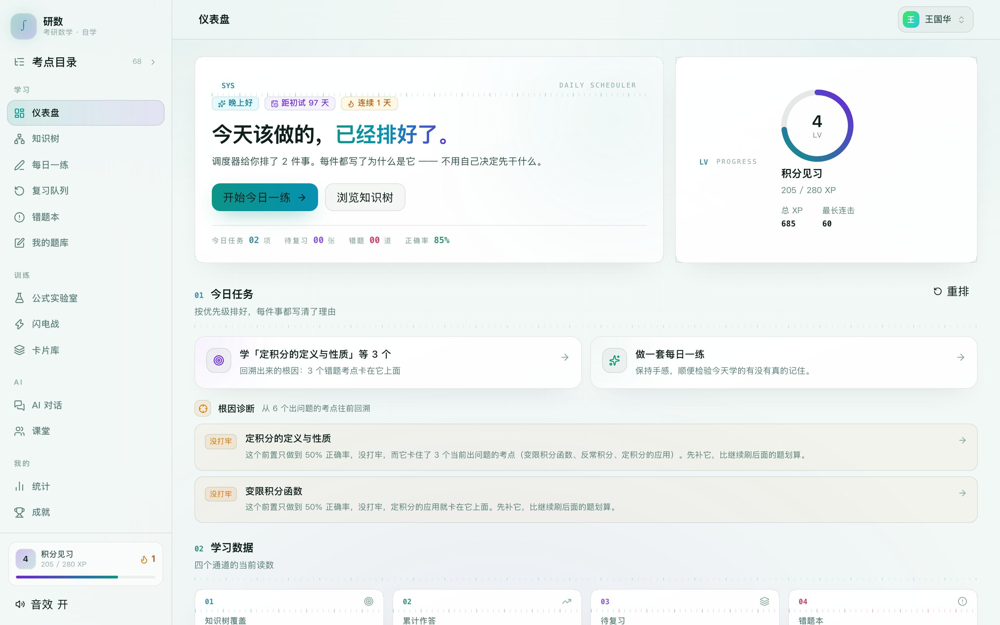
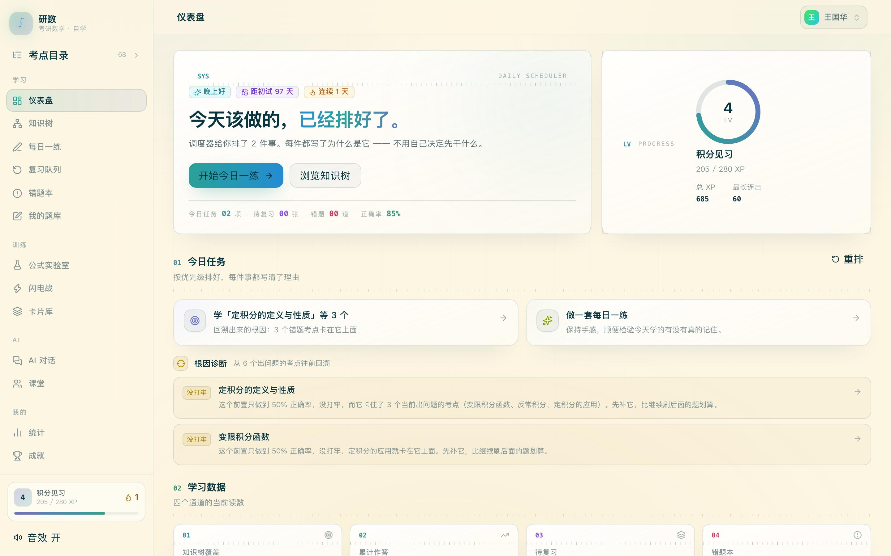

# 研数 · 考研数学 AI 自学系统

从零依赖纯前端（localStorage）重构成的前后端分离全栈版本。原来的 13 个页面、68 个知识点、204 道题**一个都没丢**，算法层（SM-2、XP、掌握度、成就）原样移植，UI 层用 React 重写，数据从浏览器搬进了 SQLite，并补上了账号体系。

知识点之间还连着一张**有向前置依赖图**（102 条边）。错题不再只告诉你「这里弱」，而是沿依赖边回溯到真正没打牢的那一环 —— 这是「刷了很多题但分数不动」的解药，见[知识图谱与根因诊断](#知识图谱与根因诊断)。

内置题刷完了也不会断：可以按考点、或者按某道错题让模型出**可自动判分的变式题**，见[变式题生成](#变式题生成举一反三)。

暗色深空 + 玻璃拟态 + **赛博网格地平线**。下面全是实拍截图，不是效果图：

### 登录 / 注册

<picture>
  
</picture>

### 仪表盘 —— 今天该做的已经排好了

<picture>
  
</picture>

### 知识星系 —— 68 个考点铺成一个可以拖着转的 3D 球

<picture>
  
</picture>

### 知识点详情 —— 公式用 KaTeX 渲染，可复制

<picture>
  
</picture>

### 公式实验室 —— 拖滑块看公式怎么「动」起来

<picture>
  
</picture>

### 成就墙 —— 25 项成就，铜 / 银 / 金

<picture>
  
</picture>

> 截图由 `npm run shots` 生成：起真浏览器、注册账号、**先灌一份有分布的学习数据再逐页拍**。
> 空状态下所有页面都是「还没有卡片」，看不出配色和密度对不对 —— 而设计问题恰恰只在有内容时才暴露。

---

## 快速开始

```bash
npm install
npm run start          # 后端会托管 web/dist，打开 http://127.0.0.1:5180
```

第一次跑之前要先构建前端（`npm run start` 找不到 `web/dist` 时只提供 API）：

```bash
npm run check          # 类型检查 + 构建
npm run start
```

macOS 上可以直接双击 `启动.command`，它会自动装依赖、构建、起服务、开浏览器。

**知识图谱数据**在 `server/src/data/edges.json`，`npm run seed` 会一并导入（有环会直接拒绝，不会让坏数据进库）。
想单独看图谱体检：

```bash
npm run edges     # 边数 / 类型分布 / 覆盖率 / 最长前置链，只校验不写库
```

**开发模式**（前后端热更新，前端 5173、后端 5180，`/api` 自动代理）：

```bash
npm run dev
```

### 管理员账号

首次启动时，服务端会检查「库里有没有管理员」。一个都没有就按下面的配置建一个：

| 环境变量 | 默认值 |
|---|---|
| `ADMIN_EMAIL` | `wukong@qq.com` |
| `ADMIN_PASSWORD` | `wgh123456` |
| `ADMIN_USERNAME` | `管理员` |

```
⚠️ 默认密码是明文写在源码里的，自托管请务必改掉：
     ADMIN_PASSWORD='你的密码' npm run start
   启动时如果还在用内置默认密码，日志里会打一条 warn。
```

如果那个邮箱**已经被注册过**（比如你先自己注册了），启动时会把该账号提为管理员，
并**重置成上面配置的密码** —— 因为原密码无从得知，不提权就进不去，提权不改密则你自己也可能进不去。
这条只在「首次提权」那一次发生；之后再启动是纯读，**不会覆盖你改过的密码**。

登录后侧栏会多出一个「管理」分组，里面有用户管理：搜人、看学情概览、
改角色 / 状态 / 备注、重置密码、强制下线、删号，以及一份管理操作审计。

<p>
  
</p>

> 停用和删号都会当场生效：停用会立刻注销该账号的全部登录会话，
> 删号靠外键级联清掉他全部学习数据（作答、卡片、错题、笔记、成就）。
> 服务端另外挡了三条会把系统搞成「没有管理员」的操作 ——
> 不能取消自己的管理员权限、不能停用自己、不能删除自己。

---

## 外观主题

8 套主题，每个账号各选各的，跟着账号走（存在 `user_settings.theme`）。
设置页第一块就是外观面板，点一下立即生效。

同一份数据、同一个仪表盘，只换主题（`npm run gallery` 生成，可重新跑）：

<p>
  
  
</p>
<p>
  
  
</p>
<p>
  
  
</p>
<p>
  
  
</p>

| 暗色 | 亮色 |
|---|---|
| **深空**（默认）青紫光谱 + 赛博网格地平线 | **宣纸** 暖白纸面 + 靛蓝 |
| **赛博绿** 磷光绿终端 | **薄荷** 冷白 + 青绿 |
| **北境** Nord 极地蓝灰 | **护眼米** Solarized Light |
| **熔岩** 暖橙暗底 | |
| **午夜玫瑰** 深紫 + 品红 | |

实现方式：Tailwind v4 的 `@theme` 把每个 token 编译成 `:root` 上的 CSS 变量，
工具类编译成 `color: var(--color-fg)` 这种**间接引用**。所以「换主题」就是在
`html[data-theme="xxx"]`（优先级 0,1,1 > `:root` 的 0,1,0）里重定义同一批变量，
工具类自动跟着变 —— 不需要 `!important`，也不需要把颜色搬到 JS 里运行时注入。

三个不那么显然的地方：

- **`--color-veil` 是唯一一个明暗主题取值方向相反的令牌。** 全站「在当前底色上叠一层」
  的地方（`bg-veil/5`、`border-veil/8`…共 137 处）都走它：暗色主题下它是白（叠亮），
  亮色主题下它是黑（叠暗）。原来这些位置写的是 `bg-white/5`，亮色主题下白叠白，
  卡片边界会**凭空消失**而页面依然「正常渲染」。
- **亮色主题的强调色整体加深一档。** 深空的 `#22d3ee` 放在白底上对比度只有 1.9:1，
  根本读不出来。所以宣纸的 cyan 是 `#0e7490` 这个量级。
- **亮色主题不挂 WebGL 背景。** 霓虹赛博网格 + 磷光星尘画在暖白底上会变成一片灰蒙蒙的脏点。
  亮色下改用 CSS 层那套淡色光晕 + 细网格 —— 那本来就是为「WebGL 挂掉时顶上来」写的降级路径。

### 断言查不出来的那几处，是截图查出来的

改造过程中有五个问题**所有断言全绿**，是给 8 套主题各截一张图、人眼横着比才发现的：

| 问题 | 症状 | 断言为什么查不出来 |
|---|---|---|
| `bg-white/5` 这类叠层 | 亮色下白叠白，卡片边界**凭空消失** | 页面照样渲染，`data-theme`、令牌值全对 |
| WebGL 着色器强调色写死在组件里 | 「赛博绿」只有 CSS 那一半变绿，占满整屏的背景还是青蓝 | 「颜色对不对」和「颜色和主题一致不一致」是两回事，前者有断言、后者没有 |
| `useTheme` 初始 state 写死默认主题 | 冷启动时亮色页面先闪一下霓虹背景 | 测试里的主题是点出来的，store 已被更新，不存在不同步的窗口 |
| 知识星系的节点药丸写死「近黑底 + 浅字」 | 亮色下变成一颗颗深灰药丸压在暖白纸上 | 它「渲染出来了」，只是丑 |
| 公式实验室画布上用 `rgba(255,255,255,0.5)` 画标签 | 亮色下「n = 4」「A = 1」「近似有效区间」**整句消失** | canvas 的 `fillText` 画完就没了，DOM 里查不到任何痕迹 |

最后一条尤其说明问题：**canvas 上画的东西，DOM 断言完全看不见**。
所以「公式实验室」这个页面必须靠截图验 —— 它的内容全在 canvas 里。

所以现在的验证路径是**两条**：断言查「渲染对不对」，截图查「看起来对不对」。
`npm run gallery` 和 `THEME=xxx npm run shots` 就是第二条路径的入口。

> 加一套新主题要改三处，缺一处都会静默失效（选了保存不上 / 保存了但没样式 / 有样式但选不到）：
> `web/src/styles/index.css` 加一个 `html[data-theme="新id"]` 块、
> `web/src/lib/themes.ts` 加一条注册表项、`server/src/lib/themes.js` 把 id 加进 `THEME_IDS`。
> 接口冒烟里有一条断言盯服务端清单，漏改会红。

---

## 目录结构

```
kaoyan-math-tutor/
├── server/                     Fastify 5 + better-sqlite3
│   ├── src/
│   │   ├── index.js            入口：鉴权闸门 / requireAdmin / 静态托管 / SPA fallback
│   │   ├── db/
│   │   │   ├── schema.sql      27 张表
│   │   │   ├── index.js        连接、建表、rebuildStats()
│   │   │   ├── migrate.js      ★ 老库补列（ALTER TABLE）+ 引导管理员
│   │   │   └── seed.js         幂等种子导入（含图谱边，有环直接拒绝）
│   │   ├── lib/
│   │   │   ├── sm2.js          间隔重复算法
│   │   │   ├── game.js         XP / 等级 / 掌握度 / 25 项成就 / 连续打卡
│   │   │   ├── graph.js        ★ 知识图谱：邻接表 / 祖先后代 / 拓扑排序 / 环检测
│   │   │   ├── diagnose.js     ★ 根因回溯 + 拓扑序学习路径 + 图谱体检
│   │   │   ├── judge.js        判题器（归一化 + 数值容差）
│   │   │   ├── password.js     scrypt 哈希
│   │   │   ├── session.js      会话（库里只存 token 的 sha256）
│   │   │   └── themes.js       ★ 主题 id 白名单
│   │   ├── routes/             auth / admin / catalog / study / cards / game / graph / misc / ai
│   │   └── data/               3 科 19 章 68 考点 204 题 + edges.json（102 条图谱边）
│   └── scripts/
│       ├── extract-seed.mjs    用 node:vm 沙箱从原 window.KDATA/QDATA 提取
│       ├── gen-edges.mjs       ★ 图谱校验 + 导入（环检测是硬门禁）
│       └── smoke.mjs           接口端到端测试（296 项）
├── web/                        Vite 8 + React 19 + TS + Tailwind 4
│   └── src/
│       ├── styles/index.css    设计系统（8 套主题 / 玻璃面 / 光谱强调色 / HUD）
│       ├── components/
│       │   ├── fx/             视觉特效层，全部自研、零依赖：
│       │   │   ├── webgl.ts            全屏片元着色器封装（约 120 行）
│       │   │   ├── CyberGrid.tsx       WebGL2 赛博网格地平线背景（仅暗色主题挂载）
│       │   │   ├── Starfield.tsx       Canvas2D 星尘（仅暗色主题挂载）
│       │   │   ├── KnowledgeGalaxy.tsx 可旋转 3D 知识星系
│       │   │   ├── Hud.tsx             仪器感装饰（角标/刻度/读数/扫描线）
│       │   │   └── Motion.tsx          数字滚动 / 倾斜卡 / 进度环 / 进度条
│       │   ├── ui/             Primitives、Math（渲染管线）、Modal、Toaster、ThemePicker
│       │   └── layout/         AppShell、AuthLayout
│       ├── lib/                api / utils / hooks / sfx / achievements / deckExport / themes
│       ├── stores/             app / auth / theme
│       └── pages/              16 个页面
└── tests/
    ├── browser-smoke.mjs       真浏览器冒烟（163 项，CDP，零依赖）
    ├── screenshot.mjs          逐页截图（npm run shots），支持 THEME= 换主题
    ├── theme-gallery.mjs       主题画廊（npm run gallery），8 套主题各一张
    ├── latex-coverage.mjs      公式渲染全量检查
    ├── pipeline-leak.mjs       渲染管线漏屏检查（真 katex 跑完整 renderRich）
    ├── graph.mjs               ★ 知识图谱与根因诊断（73 项，自建临时库，不走 HTTP）
    ├── day-boundary.mjs        日期口径检查（时区跨日）
    ├── banding.mjs             近黑渐变色带检测
    ├── lib/server.mjs          测试用的服务生命周期（空闲端口 + 一次性库）
    └── run-all.mjs             汇总入口
```

> `db/migrate.js` 为什么必须存在：`schema.sql` 全是 `CREATE TABLE IF NOT EXISTS`，
> 表已存在时**整条语句被跳过** —— 也就是说「往已有表里加一列」它做不到。
> 所以 `users.role / status / note` 三列走 `ALTER TABLE`，而凡是依赖新增列的
> **索引**也必须放在 `migrate()` 里：`schema.sql` 是整段 `exec` 的，
> 在老库上执行 `CREATE INDEX ... ON users(role)` 会直接抛 `no such column`
> 把 `initSchema` 打断，服务根本起不来（报错点在 `index.js`，看着像建表脚本坏了）。

---

## 技术选型与理由

| 选择 | 理由 |
|---|---|
| **SQLite（better-sqlite3）** | 单人自用的学习工具，上 PostgreSQL 是给自己找运维。better-sqlite3 是同步 API，事务写起来干净，不用到处 `await`。 |
| **Fastify** | schema 校验内建，把「参数不对」挡在业务代码之前。 |
| **不用 JWT，用服务端会话** | JWT 没法即时登出。「注销账号 / 登出所有设备」是刚需，所以会话表 + httpOnly cookie。 |
| **scrypt 而非 bcrypt** | Node 内置，不引原生编译依赖。N=16384 / r=8 / p=1，每用户独立盐，比对走 `timingSafeEqual`。 |
| **React + Tailwind 4** | 原版是 4492 行的字符串拼接渲染，改一处要全文搜。 |
| **Vite 8（Rolldown）** | 注意：Rolldown 下 `manualChunks` 只接受函数形式，对象形式会直接构建失败。 |
| **不引粒子库** | 星尘粒子自研不到 100 行；tsparticles 是 60–200KB。 |

---

## 数据模型

**核心不变式：明细表是权威，聚合表只是加速层。**

原版因为 localStorage 只有 5MB，必须在裁剪明细之前把统计冻结下来 —— 一旦裁剪，统计就再也没法重算。搬到数据库后这个约束消失了：

- `attempts` **全量保留**，永不裁剪
- `stats_node` / `stats_question` / `stats_daily` 纯属加速，任何时候都能用 `rebuildStats(userId)` 从明细完整重建
- 代价是每次作答要写 4 张表 —— 所以整个作答流程包在**一个事务**里，避免「题算对了但 XP 没加上」这种偏账

27 张表（含 SQLite 自建的内部表）：

```
账号      users / sessions / auth_log / user_settings / llm_settings
内容      categories / chapters / knowledge / questions
图谱      knowledge_edges
学习      attempts / stats_node / stats_question / stats_daily
复习      cards / card_deck / notes
计划      checkins / daily_plan / focus_sessions
游戏化    game_state / achievements / boss_records
AI        chats / classrooms
管理      admin_log
```

> `knowledge_edges` 单开一张表而不是给 `knowledge` 再加一列，理由见[知识图谱与根因诊断](#知识图谱与根因诊断) ——
> 方向、类型、强度都是**边**的属性，塞进节点的 JSON 列里，每次遍历都要全表扫 + 反序列化。
>
> 这张表的数字被 `smoke.mjs` 钉死了（`数据库 27 张表`）。加表时必须同步改那里，
> 那是故意的 —— 强迫改动者确认一次「我知道我加了一张表」。

---

## 算法层（从原版逐函数移植）

### 判题 `judge.js`

全角转半角、剥 LaTeX 反斜杠、`π→pi`、`√→sqrt`、`²→^2`、分数求值比对（`1/2` 等价 `0.5`）、数值容差 `1e-6`。

选择题也要过同一套归一化 —— 中文输入法下用户很容易打出全角的 `Ａ Ｂ Ｃ Ｄ`，只 `trim + toUpperCase` 会直接判错，那不是学生答错，是输入法的问题。

### 间隔重复 `sm2.js`

四档自评（1 忘了 / 2 吃力 / 3 记得 / 4 很熟）映射到 quality（1/3/4/5），EF 下限 1.3，首轮间隔 1 天。**新建的卡排在明天**，这是 SM-2 的标准行为，不是 bug。

### 掌握度

`new`（未学）→ `learning`（学习中）→ `proficient`（熟练）→ `mastered`（精通）。

精通的门槛是三条**同时**成立：该节点下每道题都答对过 + 作答 ≥ 3 次 + 正确率 ≥ 90%。

### XP 防刷分

```
answerXp = max(1, round(10 × 掌握度倍率 × 当日重复倍率))
掌握度倍率  { new: 1, learning: 1, proficient: 0.5, mastered: 0.2 }
当日重复倍率 第 1 次 1.0 / 第 2–3 次 0.7 / 第 4 次起 0.3
```

下限 1 是故意的：答错也给参与分，但不给连击。

### 等级

升到第 n 级需要 `100 + (n-1)×60` XP，12 个称号：初识极限 → 数轴新兵 → 求导学徒 → 积分见习 → 级数行者 → 多元探索者 → 曲线猎手 → 矩阵行者 → 概率赌徒 → 极限猎人 → 定理克星 → 考场主宰。

### 连续打卡

打卡条件 = 当日任务全部完成 **或** 专注时长 ≥ 30 分钟。当前连续从今天（若今天没打则从昨天）往回数。

### 成就

25 项，铜 / 银 / 金三档，纯谓词判定。发奖用幂等键 `flags[xp:key]` 去重，重复触发不会重复发。

---

## 知识图谱与根因诊断

### 它要治的病

薄弱点的旧排序是一行公式：

```
score = (1 - 正确率) × 难度 × (1 + 错题数 × 0.5)
```

它只看节点自己，于是必然得出「你在洛必达错得多，那就多刷洛必达」。但考研数学最常见的情况恰恰不是这样 —— 洛必达用不好，是因为三个月前的**极限存在性**没打牢，再刷一百道洛必达也没用。

刷题量上去了、分数不动，根子就在这里。

### 边的结构

`knowledge.related` 是**无向**的 JSON 数组：`c1n1` 写 `[c1n2]` 的同时 `c1n2` 也写 `[c1n1]`，两边都写，方向信息就没了。没有方向就无法回答「学 A 之前该先学什么」，也无法从错题回溯到前置缺口。

所以图谱单独建表。方向、类型、强度都是**边**的属性，不是节点的属性：

```sql
CREATE TABLE knowledge_edges (
  from_kid TEXT,      -- 前置（先学的）
  to_kid   TEXT,      -- 后继（后学的）
  type     TEXT,      -- prereq 前置 | related 相关 | confusable 易混
  strength TEXT,      -- hard 缺了学不动 | soft 缺了能学但吃力
  reason   TEXT,      -- 为什么这么连，给人审的
  source   TEXT       -- derived | ai | manual
);
```

`reason` 字段是刻意留的。边是模型或人写出来的，没有理由的边在审核时没法判断对错 —— 参考 `pep-math-taxonomy` 的做法，每条边都写清「认识 0 需要先认识 1~5，理解数量的存在才能理解缺失」。

**方向约定**（最容易搞反）：`from` 是前置。找祖先走 `in`，找后代走 `out`。`related` / `confusable` 是双向语义，存储只存一行，遍历时两边展开。

### 根因回溯

从每个症状节点（错题、或正确率 < 60% 且作答 ≥ 2 次）沿 `prereq` 边反向遍历，按三个因子打分：

| 因子 | 作用 | 不做会怎样 |
|---|---|---|
| `masteryGap` | 掌握缺口 | 会把「你早就学会的基础」也推给你 |
| `coverage` | 症状覆盖数（被**多少个当前出问题的节点**依赖） | 退化成「哪个错题多先做哪个」 |
| `depthPenalty` | 距离衰减 `1/√d` | 隔 4 层的前置排到第一 |

`coverage` 用的是**症状覆盖数**而不是后代总数 —— 后代总数是静态的（极限永远是 20 个考点的祖先），覆盖数才是动态的，跟着你当前错在哪走。

两个容易做错的地方，都有测试钉着：

- **未作答 ≠ 掌握度 0**。未作答节点的 `accuracy` 也是 0，直接算缺口会得到满分 1，把「你没碰过导数定义」排到「你求导法则 0 分」前面。后者是实证，前者只是推测。所以未作答的缺口取 0.5。
- **已熟练的前置不是根因**。`proficient` / `mastered` 的节点直接跳过，否则会推荐你回去学早就学会的东西。

输出带 `kind`：`gap`（没学过，得去**学**）和 `weak`（学过但没打牢，得去**补**）。混成一个「薄弱」，用户不知道该干嘛。

### 学习路径：根因优先是规则，不是权重

`nextToLearn()` 按拓扑序推荐，但**前置没打牢的节点不进候选**：

- hard 前置 —— 必须学过，且正确率 ≥ 0.5（学过但 0 分不算数）
- soft 前置 —— 只要学过就放行

不严到「必须 proficient」，否则大部分人会永远无路可走；也不松到「只要学过」，否则系统会推荐你硬上自己 0 分的前置 —— 那正是这个功能本来要治的病。

唯一的例外是根因节点，它豁免拦截：根因是用户**实际做错过**的地方，证据比「拓扑序上还没轮到」强。

排序时根因一律排最前，且根因之间**严格按诊断排名**。这里踩过一个坑：一开始把「根因优先」做成 score 里的加分项（+3，按排名每级减 0.5），结果加分差 0.5，而「前置完成度」这一项能差 1.0 —— 诊断排第 2 的根因被一个前置齐全的普通节点挤到第 3，两个接口给出的顺序对不上。**根因优先是个规则，做成权重就一定会被淹没。**

### 错因归类

「答错」是二值事实，「为什么错」才决定下一步：概念混淆要回去补前置，计算失误只需要练熟练度，方法不会得先看例题。`attempts.error_type` 存这个，六类：

`concept` 概念混淆 / `calc` 计算失误 / `condition` 条件遗漏 / `method` 方法不会 / `misread` 审题偏差 / `blank` 未作答

判成 `concept` 时会触发图谱回溯，直接给出「建议先回看 X」。提示词里写死了一条：**方向性的理解错误一律归 concept，不要归 calc** —— 学生以为自己粗心、实际是没理解，这种情况极常见，误判成 calc 会让他继续刷题而不是回去补基础。

不做成「答错就自动判」：每答错一题多一次模型调用，一晚上刷 50 道就是 50 次请求。做成错题本里按需触发 + 批量版本。

### 怎么改图谱数据

数据源是 `server/src/data/edges.json`，**唯一真相源**。改完跑：

```bash
npm run edges     # 校验 + 图谱体检（不写库）
npm run seed      # 写库（seed 会整表重建边，保证库与文件一致）
```

校验是硬门禁：**有环直接拒绝导入**。环意味着「A 是 B 的前置、B 又是 A 的前置」，语义上不成立，而且会让拓扑排序死循环。悬空边（指向不存在的知识点）、重复边、缺 `reason` 也会报出来。

> 不建议上 Neo4j。68 个节点、102 条边，SQLite 递归 CTE 一秒出结果；本机连 Docker 都没有，上图库纯粹是给自己找运维。

---

## 变式题生成（举一反三）

内置题库只有 204 道（每个考点正好 3 道），刷完就断了。而错题重做三遍，记住的是「这道题的答案」，不是「这类题的方法」—— 换个数字照样错。变式题给的是后者。

两个入口：

- 知识点详情 →「举一反三」：按考点出一组练习（题库刷完时用）
- 错题本 → 展开某道题 →「举一反三」：带上这道题、学生答案和错因，出针对性变式

### 最关键的设计：生成的题必须判得了分

这是整个功能的成败点。判题器（`judge.js`）只对**数值**做容差比对，对 LaTeX 命令的归一化是不完整的 —— 标准答案 `\sqrt{2}` 归一化后是 `sqrt{2}`，而用户输入 `√2` 归一化后是 `sqrt2`，两者并不相等。

一旦混进判不了的题，用户答对了系统说错，**比没有这个功能还糟**。所以生成结果要过一道 `sanitizeGenerated()`：

| 模型给的形状 | 处置 |
|---|---|
| 选择题选项不是正好 A/B/C/D | 丢弃（三个选项会让前端渲染错位） |
| `\frac{1}{2}` | 转成 `1/2` |
| `x=2` / `y=-1/2` | 剥成 `2` / `-1/2` |
| 答案含根号、π、字母 | 丢弃（提示词里让模型改用选择题） |
| 答案含中文（「无解」） | 丢弃 |
| 多解（`x_1=1, x_2=2`） | 丢弃 |

提示词里也写死了「填空题答案只能是整数、分数或小数」。**两道防线都要有**：提示词管住大多数，清洗函数兜住剩下的。

多解析两道当缓冲（要 3 道就让它出 5 道）—— 模型总会出一两道不可判的，不多要的话用户点了「生成 3 道」结果只拿到 1 道。

### 落库与掌握度

生成的题写进 `questions` 表，`owner_id` = 当前用户，id 前缀 `g_`（内置题是 `q01` 这种，前缀不同，所以 seed 重跑不会覆盖它们）。落库后它们出现在题库里，也参与掌握度计算 —— 练了不涨分的话，用户没理由继续用这个功能。

但有一条例外：**「精通」判定只看内置题**。

`allRight`（该考点下每道题都答对过）衡量的是「官方题库覆盖完了没」，是个客观刻度。把自建题也算进去的话，用户生成 20 道变式题就永远评不上精通了 —— 那不是严格，那是拿自己出的题把自己堵死。而且 AI 出题数量不限，让它参与等于给「精通」加了一个可以无限膨胀的门槛。

> 这里有个**架构约束**必须守住：`getTree()` 是进程级共享缓存，所有用户共用一份，所以它只装内置题。
> 自建题必须按用户单独查（`masteryBoard` 里一次查完，避免逐节点查库）。
> 谁图省事把自建题塞进全局树，别的用户就会看到别人的题 —— 测试里有断言钉着这条。

---

## 富文本渲染管线（最容易被改坏的地方）

输入有两个来源，格式**不一样**：

- **模型输出**：数学写在 `$...$` / `$$...$$` 里
- **库里的数据**：**裸 LaTeX，一个 `$` 都没有** —— 68 个知识点的正文与例题、204 道题的题干与解析，全是「中文句子里夹着 `\frac{...}`」

两者进同一个渲染器，所以顺序至关重要：

```
1. 行内代码 `...`        → 摘成占位符
2. Markdown 链接          → 摘成占位符（URL 里带 _ 和 &，晚了会被当公式）
3. 已带定界符的数学 $…$   → KaTeX
4. __加粗__               → 摘成占位符（晚了会被 autoLatex 当两个裸下标）
5. autoLatex              → 给裸 LaTeX 补 $
6. 刚补出来的 $…$         → KaTeX
7. 剩余纯文本             → HTML 转义 → Markdown 强调
8. 占位符回填
```

顺序反了会出两种 bug，都真实踩过：

- **先按 `$` 切分再套 `**`**：「`**当 $x\to 0$ 时**`」被从中间切开，两半各剩一个 `**`，屏幕上就是裸露的星号
- **autoLatex 在 `$` 之前跑**：把已有的 `$\frac{1}{2}$` 再包一层 `$`，原来的定界符反而变成普通字符打到屏幕上

占位符用 `\u0001N\u0002`，并且被 `FRAG_STOP` 当作硬边界 —— 这样 autoLatex 的片段回溯不会跨过已渲染的公式去吞文本。

**验证方式**：`tests/browser-smoke.mjs` 会抽 4 个知识点 + 每日一练，把所有已交给 KaTeX 的节点从 DOM 里删掉后，检查剩余文本里不再有 `\命令` 和 `**` / `$$` / 占位符。

---

## 安全

| 项 | 做法 |
|---|---|
| 密码 | scrypt（N=16384, r=8, p=1）+ 每用户 16 字节随机盐 + `timingSafeEqual` |
| 会话 token | 32 字节随机值，**库里只存 `sha256(token)`**，原文仅存在于 httpOnly cookie |
| Cookie | `httpOnly` + `sameSite=Lax`（生产环境自动加 `secure`），30 天 TTL |
| 账号探测 | 登录时即使用户不存在也走一次哈希计算，响应时间不泄露账号是否存在 |
| API Key | **服务端存库，永不回传原文**。`GET /api/settings/llm` 只返回 `hasKey` 布尔 + `keyPreview`（前 6 后 4 位）。`/api/export` 默认剥掉 Key |
| 限流 | 注册 / 登录 10–12 次每 10 分钟 |
| 鉴权闸门 | 全局 `onRequest` 钩子，白名单之外所有 `/api/*` 都必须带有效会话 —— 挂在每个路由上迟早漏一个 |
| 管理员鉴权 | `/api/admin/*` 每条路由**逐条**挂 `requireAdmin`，且每次都回库读 `role`。不信会话里的快照 —— 会话 30 天有效，缓存 role 会让「撤掉某人的管理员」要等他重新登录才生效 |
| 权限护栏 | 不能取消自己的管理员权限 / 不能停用自己 / 不能删除自己 / 不能把最后一个管理员降级、停用或删除。都在服务端，前端置灰只是体验 |
| 停用即时生效 | 停用会 `DELETE FROM sessions WHERE user_id = ?`。只在登录处拦的话，对方手里那个 30 天 cookie 还是有效的，「停用」是假的 |
| 越权响应 | 一律 403 + `code=FORBIDDEN`，且响应体里不带任何用户数据（不返回 404 是为了避免被用来探测哪些 id 存在） |
| 管理台隐私边界 | 管理员看得到**学情统计**，看不到密码哈希/盐、别人的 LLM API Key、聊天正文、笔记内容。能看的是「有多少条」不是「内容是什么」 |
| SQL 注入 | 列表排序走**白名单映射**（`SORTS` 对象），绝不把前端传来的字符串拼进 `ORDER BY` —— 参数化占位符在 `ORDER BY` 上不生效，列名不是值 |
| 管理审计 | 所有写操作进 `admin_log`（操作者 / 目标 / 改前改后值 / IP）。**不记密码原文，连脱敏都不记** —— 审计日志会被导出、会被截图 |

> 原版把 API Key 存在 localStorage，任何 XSS 都能拿走。这是搬服务端最主要的动机之一。

---

## 测试

```bash
npm test               # 跑全部：13 + 23 + 73 + 14 + 296 + 163 + 1 = 583 项
npm run test:api       # 只跑接口
npm run test:browser   # 只跑浏览器
npm run test:latex     # 只跑公式渲染全量检查
npm run test:pipeline  # 只跑渲染管线漏屏检查
npm run test:graph     # 只跑知识图谱与根因诊断
npm run test:day       # 只跑日期口径检查
npm run banding        # 近黑渐变色带检测（画布原生 1:1，零 npm 依赖）
npm run shots          # 逐页截图，供人眼审查（不是断言）
npm run gallery        # 生成主题画廊（8 套主题各一张，进 docs/screenshots/themes）
```

逐页截图可以换主题 —— 暗色下调好的东西搬到亮色下会不会瞎，只有人眼横着比才看得出来：

```bash
THEME=paper OUT=/tmp/shots-paper npm run shots    # 亮色下把所有页面过一遍
THEME=cyber-lime npm run shots                    # 文件名自动加 -cyber-lime 后缀
FORMAT=jpeg npm run shots                         # 给文档用（体积约 1/6）
```

它覆盖 16 个页面（含 `/admin`，会自动用引导管理员登录；登录不上就跳过并出声）。
输出格式默认 PNG（供人细看），`FORMAT=jpeg` 走 CDP 自己的编码器 ——
所以想重新生成 README 里的文档图，不需要装任何图片处理库。

截图默认是桌面 1440×900，视口可以覆盖 —— 全屏 WebGL 背景、HUD 装饰层、
3D 星系这三样都是按桌面比例调的，窄屏上会不会挤成一团，桌面截图里一个都看不出来：

```bash
W=390 H=844 MOBILE=1 OUT=/tmp/shots-m npm run shots   # 手机视口
W=820 H=900 OUT=/tmp/shots-t npm run shots            # 平板 / 窄桌面
```

`MOBILE=1` 会打开 Chrome 的移动端模拟（触摸 + viewport meta 生效）。
只改宽度不改这个，量出来的是「窄桌面」而不是「手机」。

**不需要先起服务。** `npm test` 会自己挑一个空闲端口、用一次性数据库起一个服务，跑完杀掉并删库 —— 它不会碰 `server/data/app.db`，也不会因为你本机开着 dev 服务而冲突。

想对着已经在跑的服务测：

```bash
BASE=http://127.0.0.1:5180 npm test
```

> 这个设计是踩坑换来的。两个套件以前都假设「5180 上已经有人把服务起好了」，于是测试结果不取决于代码，而取决于**当时那个服务是谁起的、连的哪个库、有没有被改过**。实际代价：本机残留的旧服务占着端口，新服务绑不上，满屏「等待超时」，报出 44 项失败 —— 而代码一行没错。反过来更阴：残留服务恰好是好的，测试全绿，但你验证的其实是几分钟前编译的旧产物。

- **接口套件**（`server/scripts/smoke.mjs`）：注册 → 会话 → 知识树 → 真实判题作答 → 学情 → 错题 → SM-2 复习 → 统计 → 成就 → 每日任务 → 课堂持久化 → 导出 → 登出重登 → **多账号数据隔离** → **管理员与权限**。
- **浏览器套件**（`tests/browser-smoke.mjs`）：用系统里已有的 Chromium 内核 + Node 22 自带的 `WebSocket` 说 CDP，**零 npm 依赖**。真开页面走完 14 个路由，断言 canvas 真的画了东西（数非透明像素）、切模块后画布真的重画、拖滑块读数真的变、公式真的渲染且没漏源码、**切主题后底色与文字对比度真的翻过来**、**管理台普通用户进不去而管理员进得去**。找不到浏览器会优雅跳过。
- **渲染套件**（`latex-coverage.mjs` + `pipeline-leak.mjs`）：用真 katex 跑完整 `renderRich`，全量扫 204 题 + 68 知识点共 1304 段文本，检查两条不变量 —— KaTeX 解析失败 = 0、裸命令漏屏 = 0。管线代码是**从 `Math.tsx` 现场抽**的（调 tsc），不手抄副本。

### 图谱测试为什么自己建库

`tests/graph.mjs` 不走 HTTP，而是把 `DB_PATH` 指到一个临时文件，seed 完直接调函数。

理由很实际：要验的是「根因回溯对不对」。借 `npm test` 起好的服务来测的话，得先注册账号、再一道道答题把数据造出来 —— 为了验一个回溯逻辑要发几十个请求，慢且脆。直接建库 + 直接调 `diagnoseRoots()`，73 项断言两秒跑完。

**一半断言是反着写的**（`ok(!roots.some(...))`）。推荐类逻辑最容易出的错不是「没推」，而是**推了不该推的**：把已经掌握的前置当根因、把前置没学的节点塞进学习路径。正向断言抓不到这些。

这个套件抓出过三个真 bug，另外钉住了一条容易被改回去的设计约束，每个都有对应断言：

| 抓到的坑 | 断言 |
|---|---|
| 未作答节点缺口算成满分，把「没碰过」排到「确实做错」前面 | 有实证 weak 根因时，纯 gap 不许排第一 |
| 只拦 `level === 'new'` 的前置，正确率 0% 的照样放行 | 硬前置 0 分时后继不该被推荐 |
| 根因加分被「前置完成度」压过，诊断与推荐顺序对不上 | 推荐里根因的顺序必须与诊断排名一致 |
| 自建题被算进 `allRight`，生成越多越评不上「精通」 | 加了未作答的自建题后仍应是精通 |

> 改这几个参数（`GAP_UNKNOWN` / `BLOCK_ACCURACY` / 排序规则）之前，先把对应断言读一遍。
> 每个值都对应上面某一行失败，不是随手调的。

### 权限测试为什么必须打到服务端

「把管理入口藏起来」不是权限。手敲 `/admin`、直接 `curl` 接口都绕得过去。
所以那一节的断言全部对着 HTTP 状态码，而不是「按钮在不在」：

```
普通用户 → GET  /api/admin/users           期望 403 + code=FORBIDDEN
普通用户 → PATCH /api/admin/users/1 {role} 期望 403
普通用户 → DELETE /api/admin/users/1       期望 403
管理员   → PATCH /api/admin/users/<自己> {role:'user'}  期望 400 SELF_DEMOTE
管理员   → PATCH /api/admin/users/<自己> {status:'disabled'} 期望 400 SELF_DISABLE
管理员   → DELETE /api/admin/users/<自己>  期望 400 SELF_DELETE
```

> ★ 浏览器套件里那条「删自己」的断言，**必须先问出自己的 id，不能写死 1**。
> 写死的话，万一 id 1 不是管理员而是某个普通用户，那一发 `DELETE` 会真的把他
> 连数据一起删掉 —— 测试自己把库改坏了，而且它还会「通过」（返回 200 也是真删了）。

### 主题测试为什么量计算样式

主题坏掉的典型表现是「页面不报错、控制台干净、截图看着有颜色，
只是某些文字和底色撞在一起了」。那种坏法只有量对比度才看得见，
所以那几条断言读的是 `getComputedStyle` 而不是截图：

- 切到宣纸后 `--color-veil` 必须从白翻成深色（不翻的话 137 处卡片边界凭空消失）；
- 正文标题的实际 `color` 三通道都要 < 140（否则就是浅色压浅底）；
- 卡片描边的实际 `borderTopColor` 必须是深色、卡面必须是亮的；
- 切回深空后 `html` 的 background 要回到 `rgb(5, 6, 12)`。

> 一个真踩过的坑：首屏防闪的内联脚本会给 `<html>` 写一个**行内** `background`，
> 而行内样式优先级高于样式表 —— 于是 `html { background: var(--color-ink-950) }`
> 被永久压住，切主题时其它颜色都变了、唯独页面底色不变。
> 修法是 `applyTheme()` 里显式 `removeProperty('background')`。
> 这个 bug 的表现极具欺骗性：`data-theme` 对了、令牌对了、正文也变深了，
> 只有背景没动 —— 只看截图或者只读 `dataset` 都会漏掉它。

### 日期口径检查（`tests/day-boundary.mjs`）

这一套盯的是一个**只在凌晨发作**的 bug。

`game.js` 里有两处兜底写的是 `new Date().toISOString().slice(0, 10)` —— 那是 **UTC** 日期；
而全站其它地方的 `todayStr()` 用的是本地 `getFullYear/getMonth/getDate`。
在 UTC+8 上，北京时间 00:00–08:00 期间两套口径差一天，后果是：
深夜打完卡连续天数不涨、每日任务的「今天」还停在昨天、防刷分档位错一档。

> 这个 bug 是 CI 抓出来的，而且**只在特定时段失败** —— runner 跑在 UTC，
> 但 workflow 把 `TZ` 钉成了 `Asia/Shanghai`，跑的时候正好落在窗口内。
> 也就是说它平时是绿的，偶尔红一次，看起来像 flaky。

测试的做法不是「在 Asia/Shanghai 下跑一遍」——那样三分之二的时间会假绿。
它先算出此刻 UTC 的小时数，再挑一个**必定跨过日期线**的时区
（UTC ≥ 10 点用 UTC+14，否则用 UTC-11，两者拼满 24 小时），
把 TZ 钉给一个自己起的服务，然后验快照的 `today`、打卡后的连续天数、
每日任务日期、今日作答计数全部落在那个时区的「今天」上。

> 这套件**故意无视 harness 传来的 `BASE`**，永远自己起服务。
> 共享服务跑在 harness 的时区下，而那个时区和 UTC 是不是同一天取决于几点跑 ——
> 实测踩过：单独跑 14 项全过，塞进 `npm test` 就报 5 项失败，
> 因为断言用的是构造出来的时区，服务却跑在另一个时区上。

> 浏览器套件里有个关键细节：启动参数必须带 `--use-gl=angle --use-angle=swiftshader --enable-unsafe-swiftshader`。**不加这三个参数，headless 下 `getContext('webgl2')` 直接返回 null**，赛博网格背景会静默降级成 CSS 备胎 —— 于是「背景画出来了」这条断言测的其实是备胎，主胎装没装上根本不知道。SwiftShader 是纯 CPU 实现，慢，但确定性好（CI 上也一样）。

> 还有一条反过来的坑：**headless Chrome 默认上报 `prefers-reduced-motion: reduce`**。所以「等 350ms 看动画有没有动」这种断言在 CI 上必红，而它红的原因跟代码好坏毫无关系 —— 组件是**遵守**这个偏好的。要验「主循环还活着」，得用 CDP 的 `Input.dispatchMouseEvent` 真拖一下：拖动是用户主动操作，任何偏好下都必须生效。
>
> 顺带一提，不要用 JS 造 `PointerEvent` 来模拟拖拽 —— 组件里调了 `setPointerCapture`，合成事件的 `pointerId` 是假的，会直接抛异常，然后你会以为是自己代码写错了。

> 这一层还有一个隐蔽的坑：`skip()` 出来的「因环境跳过」既不算通过也不算失败，如果汇总行只报 pass，那么「本机跑不了 WebGL、4 条断言被跳过」和「4 条断言真跑绿了」在父进程看来**一模一样**。所以跳过数必须写进汇总行，`run-all.mjs` 那边也要显式出声。

> 这两个套件是有价值的：`vite build` 通过 + `tsc` 零错误 + 接口全绿的那一版，**整个应用是白屏的** —— `App.tsx` 里 `BootScreen` 调了 `useLocation()` 却渲染在 `<BrowserRouter>` 外面。只有真开一次浏览器才发现。
>
> 还有一条纪律：**别把「跳过」当「通过」。** 浏览器套件找不到 Chromium 时会打印说明并以 0 项退出，而 0 项和全绿在汇总里长得一样。所以 CI 里专门有一步先确认 runner 上真的有浏览器。

---

## 视觉

默认主题「深空」：暗色 + 玻璃拟态 + 赛博网格地平线，三层色彩体系（另有 7 套可选，见上面「外观主题」）：

```
--ink-*       底        背景，永远比内容暗，带一点冷色偏移
--glass-*     玻璃面    卡片与面板，半透明 + 模糊 + 一像素内发光边
--spectrum-*  光谱强调  青 → 蓝 → 紫，只用于「需要被看见的东西」
```

纪律写在 CSS 注释里：不用高饱和纯色大面积填充；强调色只出现在文字、描边、光晕和小面积填充上；**长时间盯着看的东西（正文、列表）一律用低饱和的 ink 系列**。

> 加主题时最容易忽略的一条纪律：**透明度要跟着线宽走**。图表的细网格线（1px）
> 用 0.15 才勉强可辨，而环形进度条的描边（5px）用 0.07 就够显形 ——
> 两者不能套同一个值。这条注释原来就写在 `Stats.tsx` 里，改造时保留了下来。

### 背景是三层，顺序不能换

```
-z-20  CyberGrid    WebGL2 赛博网格地平线 —— 唯一有「地面」的层，负责纵深
-z-10  Starfield    Canvas2D 星尘 —— 浮在最前，天空里要有星星
-2/-1  body::before / ::after   CSS 径向光晕 + 静态网格（降级备胎）
```

`CyberGrid` 是一个**零依赖的全屏片元着色器**（约 210 行封装 + 110 行 GLSL）：地面透视网格（主格 + 细格）、沿 z 轴推进的能量脉冲、同心涟漪、地平线暮色光带、扫描线、暗角。没有引 three.js —— 这里要的只是「一个全屏三角形 + 一个片元着色器」，three.js 是 +600KB 换一整套用不上的场景图 / 相机 / 材质系统。WebGL2 的 `gl_VertexID` 让全屏三角形连顶点缓冲都不用建。

三个工程上的决定：

- **DPR 上限 1.25**。全屏着色器是逐像素成本，2x 屏上等于 4 倍像素量，而背景是柔和渐变，1.25 与 2.0 肉眼无差 —— 像素量只有 2x 的 39%。连续掉帧（`dt > 26ms` 累计 24 帧）还会再降到 0.85。
- **编译失败不抛异常，只 `console.warn` 后返回 `null`**。背景是装饰不是功能，着色器挂掉不该让整页崩掉，上层看到 `null` 就退回 CSS 备胎。
- **拿得到 WebGL2 时，在 `<html>` 上挂 `fx-webgl` 类**，CSS 据此把静态网格从 `opacity .32` 压到 `.07` —— 一层平铺的正交网格叠在透视网格上，两套网格会互相打架。

`prefers-reduced-motion` 下只渲染一帧静态图；页面隐藏时停 rAF；`webglcontextlost` 必须 `preventDefault()` 否则浏览器不会尝试恢复。

### HUD 装饰层（`fx/Hud.tsx`）

深色 + 玻璃 + 圆角 + 渐变强调色，这套组合已经被所有 AI 产品用烂了 —— 换个 logo 就能套在任何一个 SaaS 上。问题不在配色，在**结构语言**：那些界面看起来像「网页」，不像「仪器」。数学工具本该像精密仪表盘。

所以加了一层纯装饰的 HUD：四角角标（只画两个边的 L 形，是「取景框」不是「边框」）、刻度尺（`repeating-linear-gradient` 画，150 个刻度不生成 150 个 DOM 节点）、等宽编号与读数（`01`–`06` 让一排卡片从「四个方块」变成「四个通道」）、指针跟随的描边高光（`mask` 挖掉中间只留 1px，是发光边不是发光块）、悬停时掠过的扫描线。

### 知识星系（`fx/KnowledgeGalaxy.tsx`）

知识点排成一个可拖拽旋转的 3D 球。**不用纯 CSS 3D transform** —— 节点转到球体侧面会被压成一条线，转到背面还会互相穿透。改成经典的「3D 标签云」：Fibonacci 球面布点（黄金角，不结块）、按纬度排序后切给各科目（于是每科自然形成一条纬带，颜色成片而不是随机撒点）、每帧在 JS 里做旋转 + 透视除法投影成 `translate3d + scale`。节点天然是 billboard，按深度调透明度和大小。

同章节的节点连线画在一张 canvas 上 —— 用 SVG 的话 68 条线就是 68 个 DOM 节点每帧改属性。

节点是真的 `<Link>`，能 Tab 到、能被读屏读到；搜索和逐条浏览仍由列表视图承担（顶部可切换）。星系是「看」的入口，列表是「用」的入口，两者都不能少。

**背半球必须额外压一档。** 透视除法原本是 `1 / (1 + z2 * 0.42)`，于是背面的标签半径只比正面小 30% —— 68 个标签里有一半挤在球心那一片，糊成一团。现在 `z2 > 0` 时再叠一个 `+ z2 * 0.32`：只压背面、不放大正面（放大正面只会让近处标签互相盖住）。配套把不透明度从线性改成 2.2 次幂 + 0.07 地板：

```
深度 0.25 → 0.61     深度 0.50 → 0.32     深度 0.75 → 0.14     深度 1.0 → 0.07
```

前面几个字清清楚楚，后面半颗球只剩一层星尘。地板留 0.07 而不是 0，是因为全透明的节点仍然占着 Tab 焦点 —— 键盘用户会 Tab 到「看不见的东西」上。

星系原本是这个项目里**唯一没有断言守着的旗舰组件**：主循环死掉、节点全挤在球心、切视图不生效，三种坏法都不会让页面报错，截图里也「看着有东西」。现在 `browser-smoke` 的第 3b 节有 12 条断言管着它，包括用 CDP 真鼠标事件拖一下、比对拖动前后的 `transform`。

**窄屏是另一套规则。** 桌面 1440 下一切正常，不代表 390 下也正常 —— 实测就是这么漏的：390 宽下星系外圈标签被 `overflow` 整排切掉，中间糊成一片，而**所有桌面断言全绿**。所以：

- **窄屏（< 768px）默认给列表视图**。68 个标签铺在球面上，桌面宽 1140 时前后层次拉得开；手机宽 390 时整颗球挤成一片，那就不叫「看」了，叫「猜」。星系仍在切换器里，随手能切过去。
- **球半径多了一项约束**：`1.102R + 标签半宽 ≤ 半宽`。

  这里的 1.102 是推出来的，不是拍的。球面约束下 `sqrt(x²+y²) = sqrt(1−z²)`，所以投影半径是 `f(z) = sqrt(1−z²)/(1+0.42z)` —— z = −1（最近点）时 f = 0（它在球心正上方，投影半径是 0），z = 0（赤道）时 f = 1，最大值 ≈ **1.102** 落在 z ≈ −0.42。
  **第一版按「最近点的放大倍数 1.724」算，桌面球从 320 被白砍到 285。** 结论是：别拿单个端点的系数去估极值，先把函数写出来。
- 第 3c 节有 6 条断言守着窄屏，其中一条是「没有节点被容器切掉」。`overflow-hidden` 是**视觉裁剪**，不影响 `getBoundingClientRect`，所以溢出的标签在几何上照样量得出来，不用截图比对像素。

  > 这条断言上线当天就抓到了 `LABEL_HALF` 估小了：最长的那条「多元复合函数求导（链式法则）」刚好越界一两个像素。按「圆点 6 + 间距 6 + 文字 ≤130 + padding 12 + 边框 2 = 156，再乘 1.214 倍放大取半」重算才收干净。

### 自研特效（不引库）

Canvas 星尘粒子（视差分层 + 近邻连线 + 每星独立闪烁相位 + 页面隐藏时暂停）、3D 倾斜卡片（最大 6° 的克制倾角）、鼠标跟随光晕、数字滚动、进度环、`@property --angle` 旋转渐变边、扫光按钮、WebAudio 程序化音效（零音频文件，答对音高随连击升调）。

打印用 `#print-portal` 与屏幕样式隔离；`prefers-reduced-motion` 下动画全部关闭。

---

### 五条踩过的坑

这四条有个共同点：**测试全绿、页面不报错、肉眼看着「没问题」，但那个最贵的东西其实死了 —— 或者探针指着别处。**

#### 一、透明度要跟着线宽走

图表网格最初写的是 `rgba(255,255,255,0.055)`，在普通深色底上完全合理 —— 但本站底色是 `#03040a`（近黑），叠出来约等于 rgb(17,18,23)，**对比度 1.05:1，等于没画**。雷达图尤其惨：整个三角形骨架消失，只剩一根数据线悬在空中。

判据是这条：

| 元素 | 线宽 | 可用 alpha |
|---|---|---|
| 网格线 / 分隔线 | 1px | **0.15–0.22** |
| 环形轨道 / 进度底 | 5px+ | 0.06–0.08 |

细线的可视性靠「每像素亮度差」，粗线靠「整块面积」——**线越细，alpha 越要往上加**。而直觉正好相反：细线看着「轻」，于是越调越淡。底色越黑，同一个 alpha 得到的绝对亮度差越小，所以「这个透明度够不够」不能单独判断，必须连底色明度和笔触宽度一起看。

#### 二、body 的 background 会盖住所有负 z-index 层

CSS 绘制顺序（CSS 2.1 附录 E）：

```
根元素背景 → 负 z-index 子元素 → 普通流块级元素的背景 → ……
```

注意第二项和第三项的顺序。`body` 是普通流块级元素，**它的背景画在负 z-index 之后**。所以只要 `body`（或中间任何一层）画了不透明的 `background`，`-z-20` 的赛博网格和 `-z-10` 的星尘就**整层被盖住**。

症状极具欺骗性：着色器在跑、画布尺寸正确（1800×1125）、`gl.getError()` 是 0、控制台干净、页面「有背景」—— 那是 CSS 备胎。排查了四十分钟，最后把 canvas 临时提到 `z-index: 99999` 才一眼看穿。

修法：底色挂在 `html` 上（作为画布底色，永远在最底层）。注意 `web/index.html` 里那段**首屏防闪白的内联样式**也设了 `html, body { background }`，它在 bundle 之前生效，是最容易被漏掉的一处。

现在 browser-smoke 里有三条断言守着：canvas 到 html 之间没有不透明背景、`body` 自己没背景、`html` 有底色。另加一条端到端断言 —— 把背景 canvas 藏掉再截一次图，比较全图平均亮度，差值必须大于 0.5（实测 5.1）。用全图均值而不是单点采样，是因为星尘在闪烁，单点会撞上星星造成假阳性。

#### 三、着色器编译失败是静默的

把 `` const float HORIZON = -0.12; `` 写成 `` const HORIZON = -0.12; ``（丢了类型），编译报 `ERROR: 0:14: '=' : syntax error`。因为「失败返回 null 不抛异常」这条纪律，组件**静默降级成 CSS 背景** —— 15 张截图张张看着没问题。

所以 `npm run shots` 每张图都会报一次背景走的是哪条路（`WebGL` / `CSS降级`），browser-smoke 也会断言 `fx-webgl` 已挂上。**降级态长得对，不代表主路是通的。**

#### 四、`querySelector('canvas')` 抓到的未必是你要的那个

截图脚本原本用 `document.querySelector('canvas[aria-hidden="true"]')` 报背景画布尺寸。加了知识星系之后，知识树那一张开始报 **1224×765**，而其余 14 张都是 1800×1125 —— 看起来像「背景尺寸算错了」，实际是它抓到的是**星系自己的连线画布**（DOM 里排在前面，也带 `aria-hidden`）。

修法：给关键 canvas 都挂 `data-fx`，探针点名要哪个。同理，星系节点挂了 `data-galaxy="node"`、容器挂了 `data-galaxy="host"` —— 页面上 canvas 和 `<a>` 都不止一个，**靠位置或宽泛属性选元素，迟早选错**。

> 判据是「这个数字跟其他页对不上」。如果当初没顺手把尺寸打出来，这个探针会一直悄悄指着错误的对象，而所有断言照样全绿。

---

#### 五、近黑渐变的色带是量化问题，不是调色问题

底色是 rgb(5,6,12)，地平线光带和暗角是跨几百像素的极缓渐变。隔离实验的数据：只跑着色器时，天空区一段 585 像素的跨度里梯度只有 ~0.03 色阶/像素 —— 8 位量化把几十个像素压进同一个色阶，形成**肉眼可见的同心色带**（最长平台 81px，Weber 对比度 14.4%）。

调亮度、调对比度、换颜色都治不好，只会把色带挪到别处。

**解法是在片元着色器里加 Bayer 4×4 有序抖动**（±0.5 色阶幅度），把宽平台打散成 1px 碎块。人眼把碎块积分回原来的平滑值。实测加抖动后平台占比从 0.964 降到 0.007，最长平台从 81px 压到 4px。

但这里踩了一个 headless 截图的坑：IGN（伪随机抖动）效果一样好，却是逐像素白噪声，PNG 完全压不动，截图体积从 2.2MB 涨到 4.1MB —— **而 Chromium 的 headless + 软件 GL + 动画画布组合下，captureScreenshot 会在 4.1MB 附近永久挂住**（25 秒、60 秒超时都一样，不是"慢"）。换成 Bayer（周期性图案，PNG 压得动，3.6MB）就 8/8 全过。

所以 `npm run banding` 自己做画布原生 1:1 采集（deviceScaleFactor = 1.25，与画布后备存储对齐，无重采样），冻结动画保证可复现，量的是着色器真正的输出而不是"上采样之后"的结果。 `--isolate` 还会把「着色器 / CSS 层」的贡献拆开，一旦回归立刻知道该改哪一层。

---

这类问题**测试查不出来**（元素在、尺寸对、断言全绿），只有截图用眼睛看才发现 —— 所以有了 `npm run shots`。

---

## 部署

单进程，后端托管前端构建产物：

```bash
npm run check && npm run start
```

环境变量：`PORT`（默认 5180）、`HOST`（默认 127.0.0.1）、`LOG_LEVEL`。

数据落在 `server/data/app.db`，**已在 `.gitignore` 里** —— 那里有账号和全部作答记录，绝不能入库。备份就是复制这个文件（连同 `-wal` / `-shm`，或先 `sqlite3 app.db "PRAGMA wal_checkpoint(TRUNCATE);"`）。

想换台机器：`npm install && npm run check`，然后把 `app.db` 拷过去，或者用页面上的导出 / 导入。

### 为什么不用 GitHub Pages

这个仓库以前开着 Pages，部署的是旧版纯前端静态站。全栈版**主动把它关掉了**，两个原因：

1. 全栈版的核心价值 —— 账号、跨设备同步、服务端持久化、API Key 不落浏览器 ——
   **恰恰是静态托管给不了的**。没有 Node 进程，这些一个都不成立。
2. 而如果只把 `web/dist` 发到 Pages，你会得到一个**能打开、但什么都存不住**的壳：
   注册登录接口全部 404，比没有线上版本更糟 —— 它看起来是好的。

想线上跑，就找个能跑 Node 的地方（任意 VPS / Railway / Fly.io / 家里一台常开的机器），
`npm run check && npm run start` 即可。数据是单文件 SQLite，备份就是复制 `app.db`。

> 顺带一提：Pages 的 `build_type` 是 `legacy`（Jekyll 从 master 根目录构建）。
> 所以关它必须**先于**合并全栈版 —— 否则合并会触发一次 Jekyll 构建，
> 在一个 Vite 项目上必然产出垃圾或直接失败。

---

## 已知边界

- **AI 功能需要自己配模型**。设置 → 模型接入，填 Base URL 与模型名（OpenAI 兼容接口即可）。Key 存在服务端，不进浏览器。不配也能用，只是对话 / 课堂 / 知识点提取 / **错因归类**会给出明确提示而不是静默失败。
- **知识图谱的边是手工整理的**，覆盖现有 68 个考研数学知识点（102 条边）。数学之外的科目、或者你新加的考点，需要自己在 `edges.json` 里补 —— 不补也不会坏，只是那些节点在诊断里是孤立的。
- **专业课考点库是空的**，需要自行填充。
- 多智能体课堂的「三个学生各错各的」靠提示词约束，模型不听话时页面会提示「模型这次没按格式回」，可以直接重试。
- 错因归类同样依赖模型判断。分类不准时以你自己的判断为准，`error_type` 只是个辅助标签，不参与掌握度计算。
- **变式题生成会丢题**。模型爱出开放题、根号答案、多解题，这些判题器判不了，会被丢掉 ——
  要 3 道可能只拿到 1~2 道。接口会返回 `skippedUnjudgeable` 说明丢了几道，前端也会提示。
  这是有意的：混进判不了的题，用户答对了系统说错，比不出题还糟。
- 生成的题存在 `questions` 表里（`owner_id` = 你，id 前缀 `g_`）。它们不会被 `seed` 覆盖，但会跟着账号一起导出 / 删除。
- 本机无 PostgreSQL 也无 Docker，所以选了 SQLite；真要多人在线再换。

---

## 许可

沿用原项目的 LICENSE。
